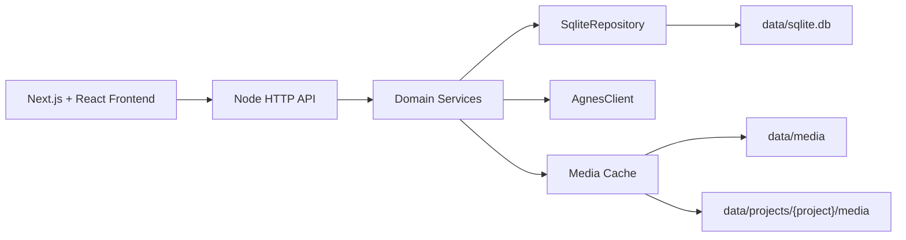

# 架构设计与开发指南

> **文档版本**: V2.0  
> **合并时间**: 2026-07-13  
> **文档状态**: 已整合  
> **来源**: 合并 architecture.md / storage.md / development.md / project-guide.md

---

## 目录

- [一、MVP架构设计](#一mvp架构设计)
- [二、技术栈](#二技术栈)
- [三、项目结构](#三项目结构)
- [四、存储方案](#四存储方案)
- [五、开发指南](#五开发指南)

---

## 一、MVP架构设计

### 1.1 范围

本实现覆盖需求规格说明书中的 P0 主流程：

- 聊天会话、消息、SSE 流式回复、停止与重新生成
- 图片生成任务、历史、收藏、删除
- 视频异步任务、轮询、历史、收藏、删除
- 设置读取与更新
- 业务数据统一写入 SQLite（`backend/data/sqlite.db`），含软删除与字段级 schema 定义
- Web 端单页应用，PC 优先并适配窄屏

### 1.2 Agnes API 配置

服务启动时会读取项目根目录 `.env`。**必须**配置 `AGNES_API_KEY`（没有 Key 时启动即失败）。

```env
AGNES_API_KEY=你的_key
AGNES_API_BASE_URL=https://apihub.agnes-ai.com
```

如官方接口路径与默认值不同，可继续配置：

```env
AGNES_CHAT_PATH=/v1/chat/completions
AGNES_IMAGE_PATH=/v1/images/generations
AGNES_VIDEO_PATH=/v1/videos
AGNES_VIDEO_TASK_PATH=/agnesapi?video_id=:taskId
```

### 1.3 架构图



### 1.4 模块职责

| 模块 | 路径 | 职责 |
|------|------|------|
| HTTP路由 | `src/http/` | 路由、响应、SSE、静态资源、媒体文件访问 |
| 业务服务 | `src/services/` | 聊天、图片、视频、收藏、项目、设置等业务逻辑 |
| 存储层 | `src/storage/` | SQLite 仓储抽象（Repository + SqliteRepository），表 schema 与 KV 设置 |
| AI层 | `src/ai/` | Agnes SDK 抽象与真实 API 实现 |
| 前端页面 | `frontend/app/` | Next.js 页面入口、图片详情页、视频详情页 |

### 1.5 核心设计原则

- **所有 AI 能力必须走真实 API**，未配置 `AGNES_API_KEY` 时 `createAgnesClient` 直接抛错，不提供任何本地模拟/兜底
- 业务数据统一存放在 SQLite，媒体文件使用本地文件系统
- 所有写入都通过参数化语句执行，避免 SQL 注入风险
- 模块化设计，支持后续功能扩展

---

## 二、技术栈

### 2.1 前端技术栈

| 技术 | 用途 |
|------|------|
| React 19 / Next.js (App Router) | UI框架 |
| TypeScript | 类型安全 |
| TailwindCSS | 样式系统 |
| Shadcn UI | 组件库 |
| Framer Motion | 动效 |
| React Query | 服务端状态管理 |
| Zustand | 客户端状态管理 |
| Axios | HTTP请求 |
| React Hook Form + Zod | 表单与校验 |
| i18next | 国际化 |
| highlight.js / shiki | 代码高亮 |
| mermaid / katex | 图表/公式 |

### 2.2 后端技术栈

| 技术 | 用途 |
|------|------|
| Node.js 24.3.x | 运行时（项目使用 `node:sqlite`，由 `.nvmrc` 与 `engines` 锁定） |
| TypeScript | 类型安全 |
| node:sqlite (Node 24 内置) | SQLite 数据库（WAL 模式、参数化语句、软删除） |
| Swagger | API文档 |
| Winston / Pino | 日志 |
| Jest | 单元测试 |

### 2.3 AI SDK 统一封装（AgnesClient）

```ts
class AgnesClient {
  chat(params: ChatParams): AsyncIterable<ChatChunk>;
  generateImage(params: ImageParams): Promise<ImageResult>;
  generateVideo(params: VideoParams): Promise<{ taskId: string }>;
  queryTask(taskId: string): Promise<TaskStatus>;
  uploadFile(file: Buffer): Promise<{ url: string }>;
}
```

**能力**：
- 统一异常处理（重试 / 熔断 / 降级）
- 统一日志（调用耗时、Token、错误）
- 统一 Token 统计
- 自动重试（指数退避，最多 3 次）
- 超时控制

---

## 三、项目结构

### 3.1 根目录

| 目录/文件 | 说明 |
|-----------|------|
| `README.md` | 项目入口说明 |
| `start-all.bat` | 同时启动前端和后端 |
| `start-backend.bat` | 只启动后端 |
| `start-frontend.bat` | 只启动前端 |
| `backend/` | 后端代码和本地数据 |
| `frontend/` | 前端页面代码 |
| `docs/` | 设计、接口、存储和开发说明 |
| `scripts/` | 清理缓存、测试辅助等脚本 |

### 3.2 后端目录

| 文件/目录 | 职责 |
|-----------|------|
| `src/http/router.ts` | HTTP 入口，所有 API 路由 |
| `src/http/ai-tasks-router.ts` | AI 任务队列路由（任务管理、批量操作） |
| `src/http/data-router.ts` | 数据中心路由（成本统计、效率分析） |
| `src/http/models-router.ts` | 模型中心路由（模型列表、设置默认） |
| `src/http/publish-router.ts` | 发布中心路由（成片管理、发布计划） |
| `src/http/pipeline-router.ts` | 8 阶段生产流水线路由（状态机、阶段推断） |
| `src/services/domain.ts` | 核心业务逻辑（创建会话、生成图片、生成视频、项目管理） |
| `src/services/module-domain.ts` | 角色/场景/道具/分镜/音频/视频/剪辑等模块业务逻辑 |
| `src/services/script-center-impl.ts` | 剧本中心服务（剧本文档、剧集、场景、对白、AI 生成） |
| `src/services/media.ts` | 图片/视频下载缓存、上传图片保存、本地媒体读取 |
| `src/services/app.ts` | 创建后端运行上下文，组装 AI 客户端、SQLite 仓库、配置 |
| `src/ai/agnes-client.ts` | Agnes 官方接口适配层 |
| `src/storage/sqlite.ts` | 基于 `node:sqlite` 的仓储实现 |
| `src/storage/schema.ts` | 每张业务表的字段定义（FieldSpec） |
| `src/storage/csv-export.ts` | CSV 导出逻辑（RFC 4180） |
| `src/types.ts` | 后端核心数据类型 |
| `data/` | 运行时数据目录 |
| `tests/` | 后端测试 |

### 3.3 前端目录

| 文件/目录 | 职责 |
|-----------|------|
| `app/page.tsx` | 主对话页面（聊天、图片、视频、收藏、项目列表） |
| `app/ai-tasks/page.tsx` | AI 任务队列页面 |
| `app/data/page.tsx` | 数据中心页面 |
| `app/models/page.tsx` | 模型中心页面 |
| `app/publish/page.tsx` | 发布中心页面 |
| `app/images/[id]/page.tsx` | 图片详情页 |
| `app/videos/[id]/page.tsx` | 视频详情页 |
| `components/dashboard/home-dashboard.tsx` | 驾驶舱（项目进度、核心指标、8 阶段流水线） |
| `components/conversation-sidebar.tsx` | 侧边栏导航 |
| `components/ui/` | 基础 UI 组件 |
| `tests/e2e/` | 端到端测试 |

### 3.4 代码阅读建议顺序

1. `README.md` —— 知道怎么运行
2. `docs/storage.md` —— 知道数据放哪里
3. `backend/src/types.ts` —— 知道系统有哪些核心对象
4. `backend/src/http/router.ts` —— 知道接口怎么进来
5. `backend/src/services/domain.ts` —— 知道具体业务怎么做
6. `frontend/app/page.tsx` —— 知道页面怎么调用接口

---

## 四、存储方案

### 4.1 总览

运行时数据主要在 `backend/data/`：

- `backend/data/sqlite.db`：SQLite 主数据库（WAL 模式下附带 `sqlite.db-shm` / `sqlite.db-wal`）
- `backend/data/media/`：不属于某个项目的通用图片、视频、上传文件
- `backend/data/projects/`：每个项目自己的媒体目录
- `backend/data/logs/`：后端请求日志与审计日志

### 4.2 SQLite 数据

所有业务实体统一存放在一份 SQLite 数据库中。表结构与字段定义集中在 `backend/src/storage/schema.ts`。

**核心业务表**：

| 表名 | 用途 |
|------|------|
| `projects` | 项目基础信息与本地存储目录 |
| `conversations` | 聊天 / 图片 / 视频生成会话 |
| `messages` | 聊天消息 |
| `project_members` | 项目成员与职责分工 |
| `project_episodes` | 剧集规划 |
| `project_storyboards` | 分镜中心 |
| `project_clips` | 剪辑清单 |
| `project_assets` | 项目资产库（图片 / 视频 / 角色 / 场景 / 风格 / 提示词） |
| `project_versions` | 资产与剧本文档的版本历史 |
| `image_tasks` | 图片生成任务 |
| `video_tasks` | 视频生成任务 |
| `favorites` | 收藏记录 |
| `work_items` | 统一工作项（任务 / 问题 / 评审 / 里程碑） |
| `app_logs` | 业务审计日志 |
| `settings` | 应用设置（KV 形式） |

### 4.3 Repository 抽象

`backend/src/storage/repository.ts` 提供：

- `Repository<T extends { id: string; created_at: string }>`：标准 CRUD
- `KeyValueRepository<T>`：设置类实体
- `FieldSpec<T>`：把领域字段声明为 `string` / `number` / `boolean` / `json` 四种类型，由 `SqliteRepository<T>` 自动建表与读写

### 4.4 设计原则

- **存储介质**：单一 SQLite 数据库文件（WAL 模式）
- **引擎**：Node 24 自带 `node:sqlite`，参数化语句避免注入
- **连接释放**：HTTP server 关闭时调用 `ctx.close()`，释放 SQLite 连接
- **可移植性**：未来可平滑切换到 MySQL / Postgres，仅需替换 `SqliteRepository<T>` 实现

### 4.5 写入与并发安全

1. **参数化语句**：所有读写都通过 `?` 占位符，避免 SQL 注入
2. **WAL 模式**：读写并发不互斥，前端轮询与业务写入可以同时进行
3. **事务**：批量插入使用 `db.exec("BEGIN")` / `db.exec("COMMIT")` 包裹
4. **关闭释放**：`ctx.close()` 在 server 关闭时调用，避免 Windows 下文件被锁

### 4.6 软删除

所有业务表均带 `deleted_at` 字段。删除操作仅写入 `deleted_at` 时间戳，UI 仍可在"5 秒撤销"内恢复。真正物理删除需要走专门的管理接口。

### 4.7 项目目录

新建项目时：
- `新建空白项目`：后端自动生成一个项目目录
- `使用现有文件夹`：输入一个相对目录名，后端在 `backend/data/projects/` 下创建或复用它

项目目录结构：

```text
backend/data/projects/{项目目录}/
  media/
    images/
    videos/
  uploads/
```

项目记录里有两个字段：
- `storage_path`：项目目录相对路径
- `storage_mode`：`managed` 表示系统创建，`existing` 表示使用现有目录名

### 4.8 媒体文件访问

普通媒体 URL：
- `/media/images/...`
- `/media/videos/...`

项目媒体 URL：
- `/project-media/{projectId}/images/...`
- `/project-media/{projectId}/videos/...`

当图片或视频属于某个项目下的会话时，后端会优先缓存到该项目的 `media` 目录中。

### 4.9 用户下载导出

业务允许把分镜表、剪辑清单导出为 CSV 文件：
- `GET /api/projects/:id/exports/storyboards.csv`
- `GET /api/projects/:id/exports/edit-list.csv`

编码逻辑封装在 `backend/src/storage/csv-export.ts`，遵循 RFC 4180。

### 4.10 删除规则

删除历史会话时，会删除：
- 这个会话的消息记录
- 这个会话的图片任务记录
- 这个会话的视频任务记录
- 指向这些图片/视频任务的收藏记录

注意：如果后续要做"彻底删除物理文件"，需要在删除任务时同时清理 `media` 下的文件。当前重点是保证记录归属和页面不再展示。

### 4.11 备份与归档

| 周期 | 动作 |
|------|------|
| 每日 02:00 | `sqlite.db` → `sqlite.db.YYYY-MM-DD.bak` |
| 每周日 03:00 | 全量 tar 备份至 OSS / S3 |
| 实时 | 通过 `rclone` / `rsync` 同步至异地 |

---

## 五、开发指南

### 5.1 启动

推荐用根目录脚本：

```bat
start-all.bat
```

它会先检查端口占用，再启动：
- 后端：`http://localhost:3000`
- 前端：`http://localhost:3001`

单独启动：

```bat
start-backend.bat
start-frontend.bat
```

### 5.2 热更新

前端使用 Next.js 开发服务器，改 `frontend/app/page.tsx`、CSS、组件后通常会自动刷新。

后端当前是 TypeScript 编译后运行。改后端代码后需要重启后端，或者执行：

```bat
cd backend
npm run start:dev
```

### 5.3 验证

后端测试：

```bat
cd backend
npm test
```

前端构建：

```bat
cd frontend
npm run build
```

完整验证：

```bat
cd backend
npm run test:all
```

### 5.4 日志

后端请求日志会写到：

```text
backend/data/logs/YYYY-MM-DD.log
```

如果前端报 `Failed to fetch`，先看：
1. 后端是否启动
2. 浏览器能否访问 `http://localhost:3000/api/conversations`
3. `backend/data/logs/` 里有没有错误堆栈

### 5.5 常见问题

**Unexpected token 'I', "Internal S"... is not valid JSON**

说明前端本来期待 JSON，但后端返回了 `Internal Server Error` 之类的 HTML 或纯文本。

先看后端终端和 `backend/data/logs/`，通常是后端抛错。

**Failed to proxy 或 socket hang up**

通常是后端进程崩了、端口不对，或者请求过程中后端重启。

先重启后端，再刷新前端页面。

**Next.js __webpack_modules__ 报错**

通常是 Next 缓存损坏。

处理方式：

```bat
node scripts\clean-next-cache.mjs
start-frontend.bat
```

**图片或视频生成失败**

检查：
1. `backend/.env` 是否有 `AGNES_API_KEY`
2. Agnes 接口路径是否和官方文档一致
3. 后端日志中真实接口返回的错误

### 5.6 改功能时看哪里

| 功能 | 文件位置 |
|------|----------|
| 页面布局 | `frontend/app/page.tsx` |
| 图片详情页 | `frontend/app/images/[id]/page.tsx` |
| 视频详情页 | `frontend/app/videos/[id]/page.tsx` |
| 接口路由 | `backend/src/http/router.ts` |
| 聊天、图片、视频业务 | `backend/src/services/domain.ts` |
| 本地文件保存 | `backend/src/services/media.ts` |
| 数据库表字段 | `backend/src/storage/schema.ts` |
| SQLite 仓储实现 | `backend/src/storage/sqlite.ts` |
| 剧本中心业务 | `backend/src/services/script-center-impl.ts` |
| 模块业务（角色/场景/分镜等） | `backend/src/services/module-domain.ts` |
| CSV 导出 | `backend/src/storage/csv-export.ts` |
