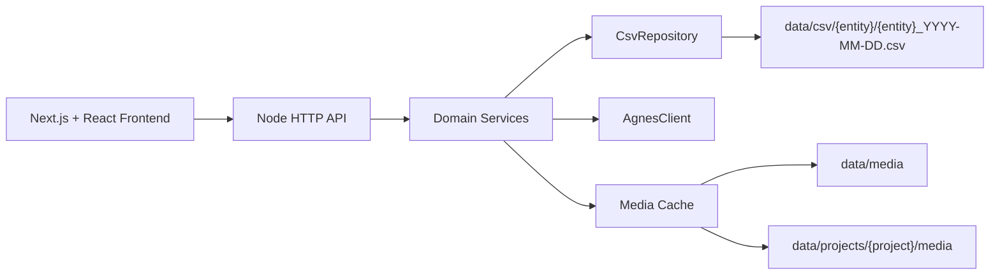

# Agnes AI Studio MVP 设计

## 范围

本实现覆盖需求规格说明书中的 P0 主流程：

- 聊天会话、消息、SSE 流式回复、停止与重新生成。
- 图片生成任务、历史、收藏、删除。
- 视频异步任务、轮询、历史、收藏、删除。
- 设置读取与更新。
- CSV 按天分文件存储，含 CSV 注入防护。
- Web 端单页应用，PC 优先并适配窄屏。

Agnes 官方 API 通过 `AgnesClient` 接口隔离。有 `AGNES_API_KEY` 且 `AGNES_USE_REAL_API=true` 时使用真实调用；否则使用本地模拟，方便没有 Key 时开发页面。

## Agnes API 配置

服务启动时会读取项目根目录 `.env`。有 `AGNES_API_KEY` 时默认使用真实 API；需要回到本地模拟时设置 `AGNES_USE_REAL_API=false`。

```env
AGNES_API_KEY=你的_key
AGNES_API_BASE_URL=https://apihub.agnes-ai.com
AGNES_USE_REAL_API=true
```

如官方接口路径与默认值不同，可继续配置：

```env
AGNES_CHAT_PATH=/v1/chat/completions
AGNES_IMAGE_PATH=/v1/images/generations
AGNES_VIDEO_PATH=/v1/videos
AGNES_VIDEO_TASK_PATH=/agnesapi?video_id=:taskId
```

## 架构



## 模块

- `src/http`: 路由、响应、SSE、静态资源、媒体文件访问。
- `src/services`: 聊天、图片、视频、收藏、项目、设置业务逻辑。
- `src/storage`: CSV 序列化、按天分片、查询、覆写更新。
- `src/ai`: Agnes SDK 抽象与本地模拟实现。
- `frontend/app`: Next.js 页面入口、图片详情页、视频详情页。

## 存储策略

CSV 文件按业务实体和日期分片。更新/删除采用读取相关分片、修改内存记录、原子写临时文件再 rename 的方式，MVP 保持实现简洁可验证。所有文本字段写入前会执行 RFC 4180 转义，并对 `= + - @` 开头的字段加 `'` 前缀以降低 CSV 注入风险。

项目会记录 `storage_path`，并在 `backend/data/projects/{storage_path}` 下创建 `csv`、`media/images`、`media/videos`、`uploads` 目录。属于项目会话的图片/视频会优先缓存到项目媒体目录，通过 `/project-media/{projectId}/...` 访问。

## API

所有 JSON API 返回：

```json
{ "code": 0, "message": "ok", "data": {} }
```

核心路径与需求规格保持一致：

- `GET/POST/PUT/DELETE /api/conversations`
- `GET /api/conversations/:id/messages`
- `POST /api/chat`
- `POST /api/chat/regenerate`
- `POST /api/chat/stop`
- `POST /api/images/generate`
- `GET/DELETE /api/images`
- `POST /api/videos/generate`
- `GET/DELETE /api/videos`
- `GET/POST/DELETE /api/favorites`
- `GET/PUT /api/settings`
