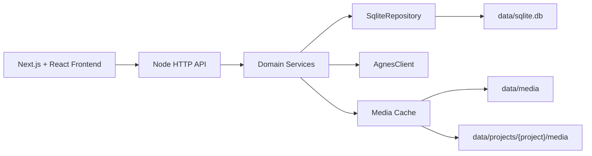

# Agnes AI Studio MVP 设计

## 范围

本实现覆盖需求规格说明书中的 P0 主流程：

- 聊天会话、消息、SSE 流式回复、停止与重新生成。
- 图片生成任务、历史、收藏、删除。
- 视频异步任务、轮询、历史、收藏、删除。
- 设置读取与更新。
- 业务数据统一写入 SQLite（`backend/data/sqlite.db`），含软删除与字段级 schema 定义。
- Web 端单页应用，PC 优先并适配窄屏。

Agnes 官方 API 通过 `AgnesClient` 接口隔离。**所有 AI 能力必须走真实 API**，未配置 `AGNES_API_KEY` 时 `createAgnesClient` 直接抛错，不提供任何本地模拟/兜底。

## Agnes API 配置

服务启动时会读取项目根目录 `.env`。**必须**配置 `AGNES_API_KEY`（没有 Key 时启动即失败）。

```env
AGNES_API_KEY=你的_key
AGNES_API_BASE_URL=https://apihub.agnes-ai.com
```

如官方接口路径与默认值不同，可继续配置：

```env
AGNES_CHAT_PATH=/v1/chat/completions
AGNES_IMAGE_PATH=/v1/images/generations
AGNES_VIDEO_PATH=/v1/videos
AGNES_VIDEO_TASK_PATH=/agnesapi?video_id=:taskId
```

## 架构



## 模块

- `src/http`: 路由、响应、SSE、静态资源、媒体文件访问。
- `src/services`: 聊天、图片、视频、收藏、项目、设置业务逻辑。
- `src/storage`: SQLite 仓储抽象（`Repository<T>` + `SqliteRepository<T>`），表 schema 与 KV 设置。
- `src/ai`: Agnes SDK 抽象与真实 API 实现。
- `frontend/app`: Next.js 页面入口、图片详情页、视频详情页。

## 存储策略

业务数据统一存放在 `backend/data/sqlite.db`（使用 Node 内置 `node:sqlite` 模块，WAL 模式）。`SqliteRepository<T>` 负责建表、增删改查与软删除；`SqliteSettingsRepository<T>` 负责 KV 形式的设置。`json` 类型字段以 JSON 字符串形式持久化。所有写入都通过参数化语句执行，避免文本协议注入风险。

媒体文件继续使用本地文件系统：通用媒体在 `backend/data/media/`，项目自有媒体在 `backend/data/projects/{storage_path}/media/`，通过 `/project-media/{projectId}/...` 访问。

## API

所有 JSON API 返回：

```json
{ "code": 0, "message": "ok", "data": {} }
```

核心路径与需求规格保持一致：

- `GET/POST/PUT/DELETE /api/conversations`
- `GET /api/conversations/:id/messages`
- `POST /api/chat`
- `POST /api/chat/regenerate`
- `POST /api/chat/stop`
- `POST /api/images/generate`
- `GET/DELETE /api/images`
- `POST /api/videos/generate`
- `GET/DELETE /api/videos`
- `GET/POST/DELETE /api/favorites`
- `GET/PUT /api/settings`
