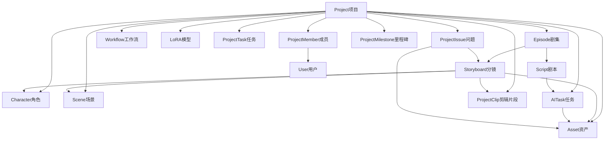

# 数据字典文档（Data Dictionary）

> 本文档定义《AI漫剧项目管理系统》V1.0的核心业务对象数据结构,包括字段定义、数据类型、约束条件和索引设计。

---

## 1. Project（项目）

### 1.1 表名

`projects`

### 1.2 字段定义

| 字段名 | 字段类型 | 是否必填 | 默认值 | 约束条件 | 说明 |
|--------|---------|---------|-------|---------|------|
| **id** | INTEGER | ✓ | 自增 | PRIMARY KEY | 项目ID |
| **project_code** | VARCHAR(50) | ✓ | 自动生成 | UNIQUE, NOT NULL | 项目编码(格式:PRJ-YYYYMMDD-序号) |
| **name** | VARCHAR(100) | ✓ | - | NOT NULL | 项目名称 |
| **description** | TEXT | - | NULL | 最大1000字符 | 项目描述 |
| **season** | VARCHAR(20) | ✓ | - | NOT NULL, 格式YYYY-QQ | 季度信息(如2026-Q1) |
| **status** | VARCHAR(20) | ✓ | '规划中' | ENUM:规划中/制作中/审核中/已完成/已发布 | 项目状态 |
| **owner_id** | INTEGER | ✓ | - | NOT NULL, REFERENCES users(id) | 项目负责人ID |
| **team_size** | INTEGER | - | 1 | ≥1 | 团队规模 |
| **budget** | DECIMAL(10,2) | - | 0.00 | ≥0 | 项目预算(元) |
| **ai_budget** | DECIMAL(10,2) | - | 1000.00 | ≥0 | AI预算(元) |
| **ai_cost_used** | DECIMAL(10,2) | - | 0.00 | ≥0 | AI已消耗成本(元) |
| **start_date** | DATE | - | NULL | - | 计划开始日期 |
| **end_date** | DATE | - | NULL | ≥start_date | 计划结束日期 |
| **actual_start_date** | DATE | - | NULL | - | 实际开始日期 |
| **actual_end_date** | - | DATE | NULL | ≥actual_start_date | 实际结束日期 |
| **cover_image** | VARCHAR(255) | - | NULL | URL格式 | 项目封面图片URL |
| **created_at** | DATETIME | ✓ | CURRENT_TIMESTAMP | NOT NULL | 创建时间 |
| **updated_at** | DATETIME | ✓ | CURRENT_TIMESTAMP | NOT NULL, ON UPDATE CURRENT_TIMESTAMP | 更新时间 |
| **deleted_at** | DATETIME | - | NULL | 软删除标记 | 删除时间 |

### 1.3 索引设计

```sql
CREATE INDEX idx_projects_owner ON projects(owner_id);
CREATE INDEX idx_projects_status ON projects(status);
CREATE INDEX idx_projects_season ON projects(season);
CREATE INDEX idx_projects_created_at ON projects(created_at);
CREATE UNIQUE INDEX idx_projects_code ON projects(project_code);
```

### 1.4 约束条件

```sql
ALTER TABLE projects ADD CONSTRAINT chk_budget CHECK (budget >= 0);
ALTER TABLE projects ADD CONSTRAINT chk_ai_budget CHECK (ai_budget >= 0);
ALTER TABLE projects ADD CONSTRAINT chk_ai_cost_used CHECK (ai_cost_used >= 0 AND ai_cost_used <= ai_budget);
ALTER TABLE projects ADD CONSTRAINT chk_dates CHECK (end_date >= start_date OR end_date IS NULL OR start_date IS NULL);
```

---

## 2. Episode（剧集）

### 2.1 表名

`episodes`

### 2.2 字段定义

| 字段名 | 字段类型 | 是否必填 | 默认值 | 约束条件 | 说明 |
|--------|---------|---------|-------|---------|------|
| **id** | INTEGER | ✓ | 自增 | PRIMARY KEY | 剧集ID |
| **episode_code** | VARCHAR(50) | ✓ | 自动生成 | UNIQUE, NOT NULL | 剧集编码(格式:EP-项目ID-序号) |
| **project_id** | INTEGER | ✓ | - | NOT NULL, REFERENCES projects(id) ON DELETE CASCADE | 所属项目ID |
| **episode_number** | INTEGER | ✓ | - | NOT NULL, 1-999 | 剧集序号 |
| **title** | VARCHAR(100) | ✓ | - | NOT NULL | 剧集标题 |
| **description** | TEXT | - | NULL | 最大500字符 | 剧集描述 |
| **status** | VARCHAR(20) | ✓ | '待编写' | ENUM:待编写/编写中/待审核/已完成 | 剧集状态 |
| **script_id** | INTEGER | - | NULL | REFERENCES scripts(id) | 关联剧本ID |
| **total_storyboards** | INTEGER | - | 0 | ≥0 | 总分镜数 |
| **completed_storyboards** | INTEGER | - | 0 | ≥0, ≤total_storyboards | 已完成分镜数 |
| **total_duration** | INTEGER | - | 0 | ≥0 | 总时长(秒) |
| **cover_image** | VARCHAR(255) | - | NULL | URL格式 | 剧集封面图片URL |
| **milestones** | JSON | - | NULL | JSON数组 | 里程碑节点 |
| **created_at** | DATETIME | ✓ | CURRENT_TIMESTAMP | NOT NULL | 创建时间 |
| **updated_at** | DATETIME | ✓ | CURRENT_TIMESTAMP | NOT NULL, ON UPDATE CURRENT_TIMESTAMP | 更新时间 |
| **deleted_at** | DATETIME | - | NULL | 软删除标记 | 删除时间 |

### 2.3 索引设计

```sql
CREATE INDEX idx_episodes_project ON episodes(project_id);
CREATE INDEX idx_episodes_status ON episodes(status);
CREATE INDEX idx_episodes_number ON episodes(project_id, episode_number);
CREATE UNIQUE INDEX idx_episodes_code ON episodes(episode_code);
```

### 2.4 约束条件

```sql
ALTER TABLE episodes ADD CONSTRAINT chk_episode_number CHECK (episode_number >= 1 AND episode_number <= 999);
ALTER TABLE episodes ADD CONSTRAINT chk_storyboards CHECK (completed_storyboards >= 0 AND completed_storyboards <= total_storyboards);
ALTER TABLE episodes ADD CONSTRAINT chk_duration CHECK (total_duration >= 0);
```

---

## 3. Script（剧本）

### 3.1 表名

`scripts`

### 3.2 字段定义

| 字段名 | 字段类型 | 是否必填 | 默认值 | 约束条件 | 说明 |
|--------|---------|---------|-------|---------|------|
| **id** | INTEGER | ✓ | 自增 | PRIMARY KEY | 剧本ID |
| **script_code** | VARCHAR(50) | ✓ | 自动生成 | UNIQUE, NOT NULL | 剧本编码(格式:SCR-剧集ID-版本) |
| **episode_id** | INTEGER | ✓ | - | NOT NULL, REFERENCES episodes(id) ON DELETE CASCADE | 所属剧集ID |
| **version** | VARCHAR(20) | ✓ | 'v1.0' | NOT NULL, 格式v1.0/v1.1/v2.0等 | 版本号 |
| **version_note** | TEXT | - | NULL | 最大500字符 | 版本备注 |
| **content** | TEXT | ✓ | - | NOT NULL, 最大10万字 | 剧本正文 |
| **characters** | JSON | - | NULL | JSON数组 | 人物列表[{name, role, description}] |
| **scenes** | JSON | - | NULL | JSON数组 | 场景列表[{name, description}] |
| **is_current** | BOOLEAN | ✓ | FALSE | NOT NULL | 是否当前版本 |
| **lock_status** | VARCHAR(20) | ✓ | 'unlocked' | ENUM:unlocked/locked | 锁定状态 |
| **lock_user_id** | INTEGER | - | NULL | REFERENCES users(id) | 锁定用户ID |
| **lock_time** | DATETIME | - | NULL | - | 锁定时间 |
| **ai_analysis** | JSON | - | NULL | JSON对象 | AI分析结果 |
| **created_at** | DATETIME | ✓ | CURRENT_TIMESTAMP | NOT NULL | 创建时间 |
| **updated_at** | DATETIME | ✓ | CURRENT_TIMESTAMP | NOT NULL, ON UPDATE CURRENT_TIMESTAMP | 更新时间 |
| **deleted_at** | DATETIME | - | NULL | 软删除标记 | 删除时间 |

### 3.3 索引设计

```sql
CREATE INDEX idx_scripts_episode ON scripts(episode_id);
CREATE INDEX idx_scripts_version ON scripts(episode_id, version);
CREATE INDEX idx_scripts_current ON scripts(episode_id, is_current);
CREATE UNIQUE INDEX idx_scripts_code ON scripts(script_code);
```

### 3.4 约束条件

```sql
ALTER TABLE scripts ADD CONSTRAINT chk_lock CHECK (
  (lock_status = 'locked' AND lock_user_id IS NOT NULL AND lock_time IS NOT NULL) OR
  (lock_status = 'unlocked' AND lock_user_id IS NULL AND lock_time IS NULL)
);
```

---

## 4. Storyboard（分镜）

### 4.1 表名

`storyboards`

### 4.2 字段定义

| 字段名 | 字段类型 | 是否必填 | 默认值 | 约束条件 | 说明 |
|--------|---------|---------|-------|---------|------|
| **id** | INTEGER | ✓ | 自增 | PRIMARY KEY | 分镜ID |
| **storyboard_code** | VARCHAR(50) | ✓ | 自动生成 | UNIQUE, NOT NULL | 分镜编码(格式:SB-剧集ID-序号) |
| **episode_id** | INTEGER | ✓ | - | NOT NULL, REFERENCES episodes(id) ON DELETE CASCADE | 所属剧集ID |
| **scene_number** | INTEGER | ✓ | - | NOT NULL, ≥1 | 镜头序号 |
| **shot_type** | VARCHAR(20) | ✓ | - | ENUM:远景/全景/中景/近景/特写 | 景别 |
| **angle** | VARCHAR(20) | ✓ | - | ENUM:平视/俯视/仰视/侧视 | 角度 |
| **camera_movement** | VARCHAR(20) | ✓ | - | ENUM:固定/推/拉/摇/移/跟 | 运镜方式 |
| **duration** | INTEGER | ✓ | 5 | NOT NULL, 1-300 | 时长(秒) |
| **description** | TEXT | ✓ | - | NOT NULL, 最大500字符 | 画面描述 |
| **character_action** | TEXT | - | NULL | 最大300字符 | 人物动作 |
| **dialogue** | TEXT | - | NULL | 最大500字符 | 对白内容 |
| **notes** | TEXT | - | NULL | 最大300字符 | 镜头备注 |
| **prompt** | TEXT | - | NULL | 最大1000字符 | 图片生成Prompt |
| **prompt_version** | INTEGER | - | 1 | ≥1 | Prompt版本 |
| **character_ids** | JSON | - | NULL | JSON数组[INTEGER] | 关联角色ID列表 |
| **scene_id** | INTEGER | - | NULL | REFERENCES scenes(id) | 关联场景ID |
| **image_id** | INTEGER | - | NULL | REFERENCES assets(id) | 关联图片资产ID |
| **video_id** | INTEGER | - | NULL | REFERENCES assets(id) | 关联视频资产ID |
| **status** | VARCHAR(20) | ✓ | '待制作' | ENUM:待制作/图片制作中/视频制作中/已完成 | 分镜状态 |
| **created_at** | DATETIME | ✓ | CURRENT_TIMESTAMP | NOT NULL | 创建时间 |
| **updated_at** | DATETIME | ✓ | CURRENT_TIMESTAMP | NOT NULL, ON UPDATE CURRENT_TIMESTAMP | 更新时间 |
| **deleted_at** | DATETIME | - | NULL | 软删除标记 | 删除时间 |

### 4.3 索引设计

```sql
CREATE INDEX idx_storyboards_episode ON storyboards(episode_id);
CREATE INDEX idx_storyboards_number ON storyboards(episode_id, scene_number);
CREATE INDEX idx_storyboards_status ON storyboards(status);
CREATE UNIQUE INDEX idx_storyboards_code ON storyboards(storyboard_code);
```

### 4.4 约束条件

```sql
ALTER TABLE storyboards ADD CONSTRAINT chk_scene_number CHECK (scene_number >= 1);
ALTER TABLE storyboards ADD CONSTRAINT chk_duration CHECK (duration >= 1 AND duration <= 300);
```

---

## 5. Character（角色资产）

### 5.1 表名

`characters`

### 5.2 字段定义

| 字段名 | 字段类型 | 是否必填 | 默认值 | 约束条件 | 说明 |
|--------|---------|---------|-------|---------|------|
| **id** | INTEGER | ✓ | 自增 | PRIMARY KEY | 角色ID |
| **character_code** | VARCHAR(50) | ✓ | 自动生成 | UNIQUE, NOT NULL | 角色编码(格式:CHAR-项目ID-序号) |
| **project_id** | INTEGER | ✓ | - | NOT NULL, REFERENCES projects(id) ON DELETE CASCADE | 所属项目ID |
| **name** | VARCHAR(50) | ✓ | - | NOT NULL | 角色名称 |
| **role_type** | VARCHAR(20) | ✓ | - | ENUM:主角/配角/路人 | 角色定位 |
| **description** | TEXT | ✓ | - | NOT NULL, 最大300字符 | 角色简介 |
| **appearance** | TEXT | - | NULL | 最大500字符 | 外貌特征 |
| **personality** | TEXT | - | NULL | 最大300字符 | 性格特点 |
| **base_prompt** | TEXT | - | NULL | 最大1000字符 | 基础Prompt |
| **prompt_templates** | JSON | - | NULL | JSON数组 | Prompt模板[{name, prompt}] |
| **reference_images** | JSON | - | NULL | JSON数组[URL] | 参考图URL列表 |
| **lora_id** | INTEGER | - | NULL | REFERENCES loras(id) | 关联LoRA ID |
| **views** | JSON | - | NULL | JSON对象{front, side, back} | 三视图URL |
| **expressions** | JSON | - | NULL | JSON数组[URL] | 表情库URL列表 |
| **actions** | JSON | - | NULL | JSON数组[URL] | 动作库URL列表 |
| **usage_count** | INTEGER | - | 0 | ≥0 | 使用次数统计 |
| **created_at** | DATETIME | ✓ | CURRENT_TIMESTAMP | NOT NULL | 创建时间 |
| **updated_at** | DATETIME | ✓ | CURRENT_TIMESTAMP | NOT NULL, ON UPDATE CURRENT_TIMESTAMP | 更新时间 |
| **deleted_at** | DATETIME | - | NULL | 软删除标记 | 删除时间 |

### 5.3 索引设计

```sql
CREATE INDEX idx_characters_project ON characters(project_id);
CREATE INDEX idx_characters_role ON characters(role_type);
CREATE INDEX idx_characters_name ON characters(project_id, name);
CREATE UNIQUE INDEX idx_characters_code ON characters(character_code);
```

### 5.4 约束条件

```sql
ALTER TABLE characters ADD CONSTRAINT chk_usage_count CHECK (usage_count >= 0);
```

---

## 6. Scene（场景资产）

### 6.1 表名

`scenes`

### 6.2 字段定义

| 字段名 | 字段类型 | 是否必填 | 默认值 | 约束条件 | 说明 |
|--------|---------|---------|-------|---------|------|
| **id** | INTEGER | ✓ | 自增 | PRIMARY KEY | 场景ID |
| **scene_code** | VARCHAR(50) | ✓ | 自动生成 | UNIQUE, NOT NULL | 场景编码(格式:SCENE-项目ID-序号) |
| **project_id** | INTEGER | ✓ | - | NOT NULL, REFERENCES projects(id) ON DELETE CASCADE | 所属项目ID |
| **name** | VARCHAR(50) | ✓ | - | NOT NULL | 场景名称 |
| **scene_type** | VARCHAR(20) | ✓ | - | ENUM:室内/室外/幻想 | 场景类型 |
| **description** | TEXT | ✓ | - | NOT NULL, 最大500字符 | 场景描述 |
| **time_setting** | VARCHAR(20) | ✓ | '白天' | ENUM:白天/黄昏/夜晚 | 时间设定 |
| **lighting** | VARCHAR(20) | ✓ | '自然光' | ENUM:自然光/人工光/特殊光 | 光照条件 |
| **base_prompt** | TEXT | - | NULL | 最大1000字符 | 基础Prompt |
| **prompt_variants** | JSON | - | NULL | JSON数组 | Prompt变体[{time, lighting, prompt}] |
| **reference_images** | JSON | - | NULL | JSON数组[URL] | 参考图URL列表 |
| **views** | JSON | - | NULL | JSON数组[URL] | 多角度视图URL列表 |
| **details** | JSON | - | NULL | JSON数组[URL] | 场景细节图URL列表 |
| **usage_count** | INTEGER | - | 0 | ≥0 | 使用次数统计 |
| **created_at** | DATETIME | ✓ | CURRENT_TIMESTAMP | NOT NULL | 创建时间 |
| **updated_at** | DATETIME | ✓ | CURRENT_TIMESTAMP | NOT NULL, ON UPDATE CURRENT_TIMESTAMP | 更新时间 |
| **deleted_at** | DATETIME | - | NULL | 软删除标记 | 删除时间 |

### 6.3 索引设计

```sql
CREATE INDEX idx_scenes_project ON scenes(project_id);
CREATE INDEX idx_scenes_type ON scenes(scene_type);
CREATE INDEX idx_scenes_name ON scenes(project_id, name);
CREATE UNIQUE INDEX idx_scenes_code ON scenes(scene_code);
```

### 6.4 约束条件

```sql
ALTER TABLE scenes ADD CONSTRAINT chk_usage_count CHECK (usage_count >= 0);
```

---

## 7. Asset（资产）

### 7.1 表名

`assets`

### 7.2 字段定义

| 字段名 | 字段类型 | 是否必填 | 默认值 | 约束条件 | 说明 |
|--------|---------|---------|-------|---------|------|
| **id** | INTEGER | ✓ | 自增 | PRIMARY KEY | 资产ID |
| **asset_code** | VARCHAR(50) | ✓ | 自动生成 | UNIQUE, NOT NULL | 资产编码(格式:ASSET-类型-序号) |
| **project_id** | INTEGER | ✓ | - | NOT NULL, REFERENCES projects(id) ON DELETE CASCADE | 所属项目ID |
| **asset_type** | VARCHAR(20) | ✓ | - | ENUM:image/video/audio/document | 资产类型 |
| **name** | VARCHAR(100) | ✓ | - | NOT NULL | 资产名称 |
| **description** | TEXT | - | NULL | 最大300字符 | 资产描述 |
| **file_url** | VARCHAR(255) | ✓ | - | NOT NULL, URL格式 | 文件URL |
| **file_size** | INTEGER | ✓ | - | NOT NULL, ≥0 | 文件大小(Byte) |
| **file_format** | VARCHAR(20) | ✓ | - | NOT NULL | 文件格式(JPG/PNG/MP4/MP3等) |
| **width** | INTEGER | - | NULL | ≥0 | 图片宽度(px) |
| **height** | INTEGER | - | NULL | ≥0 | 图片高度(px) |
| **duration** | INTEGER | - | NULL | ≥0 | 视频时长(秒) |
| **thumbnail_url** | VARCHAR(255) | - | NULL | URL格式 | 缩略图URL |
| **metadata** | JSON | - | NULL | JSON对象 | 元数据信息 |
| **ai_task_id** | INTEGER | - | NULL | REFERENCES ai_tasks(id) | AI任务ID |
| **review_status** | VARCHAR(20) | ✓ | '待审核' | ENUM:待审核/审核通过/审核驳回 | 审核状态 |
| **review_result** | TEXT | - | NULL | 最大300字符 | 审核结果/驳回原因 |
| **reviewer_id** | INTEGER | - | NULL | REFERENCES users(id) | 审核人ID |
| **review_time** | DATETIME | - | NULL | - | 审核时间 |
| **created_at** | DATETIME | ✓ | CURRENT_TIMESTAMP | NOT NULL | 创建时间 |
| **updated_at** | DATETIME | ✓ | CURRENT_TIMESTAMP | NOT NULL, ON UPDATE CURRENT_TIMESTAMP | 更新时间 |
| **deleted_at** | DATETIME | - | NULL | 软删除标记 | 删除时间 |

### 7.3 索引设计

```sql
CREATE INDEX idx_assets_project ON assets(project_id);
CREATE INDEX idx_assets_type ON assets(asset_type);
CREATE INDEX idx_assets_review ON assets(review_status);
CREATE INDEX idx_assets_task ON assets(ai_task_id);
CREATE UNIQUE INDEX idx_assets_code ON assets(asset_code);
```

### 7.4 约束条件

```sql
ALTER TABLE assets ADD CONSTRAINT chk_file_size CHECK (file_size >= 0);
ALTER TABLE assets ADD CONSTRAINT chk_width CHECK (width >= 0 OR width IS NULL);
ALTER TABLE assets ADD CONSTRAINT chk_height CHECK (height >= 0 OR height IS NULL);
ALTER TABLE assets ADD CONSTRAINT chk_duration CHECK (duration >= 0 OR duration IS NULL);
```

---

## 8. AITask（AI任务）

### 8.1 表名

`ai_tasks`

### 8.2 字段定义

| 字段名 | 字段类型 | 是否必填 | 默认值 | 约束条件 | 说明 |
|--------|---------|---------|-------|---------|------|
| **id** | INTEGER | ✓ | 自增 | PRIMARY KEY | AI任务ID |
| **task_code** | VARCHAR(50) | ✓ | 自动生成 | UNIQUE, NOT NULL | 任务编码(格式:AI-类型-序号) |
| **project_id** | INTEGER | ✓ | - | NOT NULL, REFERENCES projects(id) ON DELETE CASCADE | 所属项目ID |
| **task_type** | VARCHAR(20) | ✓ | - | ENUM:文本生成/图片生成/视频生成 | 任务类型 |
| **model_provider** | VARCHAR(50) | ✓ | - | NOT NULL | AI服务提供商 |
| **model_name** | VARCHAR(100) | ✓ | - | NOT NULL | 模型名称 |
| **input_data** | JSON | ✓ | - | NOT NULL | 输入参数(Prompt/参考图等) |
| **output_data** | JSON | - | NULL | JSON对象 | 输出结果 |
| **status** | VARCHAR(20) | ✓ | '排队中' | ENUM:排队中/执行中/已完成/失败 | 任务状态 |
| **progress** | INTEGER | - | 0 | 0-100 | 进度百分比 |
| **retry_count** | INTEGER | - | 0 | 0-3 | 重试次数 |
| **error_message** | TEXT | - | NULL | 最大500字符 | 错误信息 |
| **token_usage** | INTEGER | - | 0 | ≥0 | Token消耗 |
| **gpu_usage** | INTEGER | - | 0 | ≥0 | GPU消耗(秒) |
| **cost** | DECIMAL(10,4) | - | 0.0000 | ≥0 | 成本(元) |
| **duration** | INTEGER | - | 0 | ≥0 | 执行时长(秒) |
| **asset_id** | INTEGER | - | NULL | REFERENCES assets(id) | 生成的资产ID |
| **created_at** | DATETIME | ✓ | CURRENT_TIMESTAMP | NOT NULL | 创建时间 |
| **started_at** | DATETIME | - | NULL | - | 开始执行时间 |
| **completed_at** | DATETIME | - | NULL | - | 完成时间 |
| **updated_at** | DATETIME | ✓ | CURRENT_TIMESTAMP | NOT NULL, ON UPDATE CURRENT_TIMESTAMP | 更新时间 |
| **deleted_at** | DATETIME | - | NULL | 软删除标记 | 删除时间 |

### 8.3 索引设计

```sql
CREATE INDEX idx_ai_tasks_project ON ai_tasks(project_id);
CREATE INDEX idx_ai_tasks_type ON ai_tasks(task_type);
CREATE INDEX idx_ai_tasks_status ON ai_tasks(status);
CREATE INDEX idx_ai_tasks_model ON ai_tasks(model_provider, model_name);
CREATE INDEX idx_ai_tasks_created_at ON ai_tasks(created_at);
CREATE UNIQUE INDEX idx_ai_tasks_code ON ai_tasks(task_code);
```

### 8.4 约束条件

```sql
ALTER TABLE ai_tasks ADD CONSTRAINT chk_progress CHECK (progress >= 0 AND progress <= 100);
ALTER TABLE ai_tasks ADD CONSTRAINT chk_retry CHECK (retry_count >= 0 AND retry_count <= 3);
ALTER TABLE ai_tasks ADD CONSTRAINT chk_token CHECK (token_usage >= 0);
ALTER TABLE ai_tasks ADD CONSTRAINT chk_gpu CHECK (gpu_usage >= 0);
ALTER TABLE ai_tasks ADD CONSTRAINT chk_cost CHECK (cost >= 0);
ALTER TABLE ai_tasks ADD CONSTRAINT chk_duration CHECK (duration >= 0);
```

---

## 9. User（用户）

### 9.1 表名

`users`

### 9.2 字段定义

| 字段名 | 字段类型 | 是否必填 | 默认值 | 约束条件 | 说明 |
|--------|---------|---------|-------|---------|------|
| **id** | INTEGER | ✓ | 自增 | PRIMARY KEY | 用户ID |
| **username** | VARCHAR(50) | ✓ | - | UNIQUE, NOT NULL | 用户名 |
| **email** | VARCHAR(100) | ✓ | - | UNIQUE, NOT NULL, EMAIL格式 | 邮箱 |
| **password_hash** | VARCHAR(255) | ✓ | - | NOT NULL | 密码哈希 |
| **real_name** | VARCHAR(50) | - | NULL | - | 真实姓名 |
| **phone** | VARCHAR(20) | - | NULL | 手机号格式 | 手机号(加密存储) |
| **avatar_url** | VARCHAR(255) | - | NULL | URL格式 | 头像URL |
| **role** | VARCHAR(20) | ✓ | '普通用户' | ENUM:管理员/普通用户 | 用户角色 |
| **status** | VARCHAR(20) | ✓ | 'active' | ENUM:active/inactive/banned | 用户状态 |
| **last_login_at** | DATETIME | - | NULL | - | 最后登录时间 |
| **login_count** | INTEGER | - | 0 | ≥0 | 登录次数 |
| **created_at** | DATETIME | ✓ | CURRENT_TIMESTAMP | NOT NULL | 创建时间 |
| **updated_at** | DATETIME | ✓ | CURRENT_TIMESTAMP | NOT NULL, ON UPDATE CURRENT_TIMESTAMP | 更新时间 |
| **deleted_at** | DATETIME | - | NULL | 软删除标记 | 删除时间 |

### 9.3 索引设计

```sql
CREATE UNIQUE INDEX idx_users_username ON users(username);
CREATE UNIQUE INDEX idx_users_email ON users(email);
CREATE INDEX idx_users_status ON users(status);
```

---

## 10. ProjectMember（项目成员）

### 10.1 表名

`project_members`

### 10.2 字段定义

| 字段名 | 字段类型 | 是否必填 | 默认值 | 约束条件 | 说明 |
|--------|---------|---------|-------|---------|------|
| **id** | INTEGER | ✓ | 自增 | PRIMARY KEY | 成员ID |
| **project_id** | INTEGER | ✓ | - | NOT NULL, REFERENCES projects(id) ON DELETE CASCADE | 项目ID |
| **user_id** | INTEGER | ✓ | - | NOT NULL, REFERENCES users(id) ON DELETE CASCADE | 用户ID |
| **role** | VARCHAR(20) | ✓ | - | ENUM:管理员/导演/编剧/美术/审核员 | 项目角色 |
| **permissions** | JSON | - | NULL | JSON数组 | 权限列表 |
| **join_time** | DATETIME | ✓ | CURRENT_TIMESTAMP | NOT NULL | 加入时间 |
| **created_at** | DATETIME | ✓ | CURRENT_TIMESTAMP | NOT NULL | 创建时间 |
| **updated_at** | DATETIME | ✓ | CURRENT_TIMESTAMP | NOT NULL, ON UPDATE CURRENT_TIMESTAMP | 更新时间 |
| **deleted_at** | DATETIME | - | NULL | 轆删除标记 | 删除时间 |

### 10.3 索引设计

```sql
CREATE INDEX idx_project_members_project ON project_members(project_id);
CREATE INDEX idx_project_members_user ON project_members(user_id);
CREATE UNIQUE INDEX idx_project_members_unique ON project_members(project_id, user_id);
```

---

## 11. Workflow（工作流）

### 11.1 表名

`workflows`

### 11.2 字段定义

| 字段名 | 字段类型 | 是否必填 | 默认值 | 约束条件 | 说明 |
|--------|---------|---------|-------|---------|------|
| **id** | INTEGER | ✓ | 自增 | PRIMARY KEY | 工作流ID |
| **project_id** | INTEGER | ✓ | - | NOT NULL, REFERENCES projects(id) ON DELETE CASCADE | 所属项目ID |
| **name** | VARCHAR(100) | ✓ | - | NOT NULL | 工作流名称 |
| **description** | TEXT | - | NULL | 最大500字符 | 工作流描述 |
| **stages** | JSON | ✓ | - | NOT NULL, JSON数组 | 工作流阶段[{name, status, order}] |
| **current_stage** | INTEGER | ✓ | 1 | ≥1 | 当前阶段序号 |
| **is_active** | BOOLEAN | ✓ | TRUE | NOT NULL | 是否激活 |
| **created_at** | DATETIME | ✓ | CURRENT_TIMESTAMP | NOT NULL | 创建时间 |
| **updated_at** | DATETIME | ✓ | CURRENT_TIMESTAMP | NOT NULL, ON UPDATE CURRENT_TIMESTAMP | 更新时间 |
| **deleted_at** | DATETIME | - | NULL | 轆删除标记 | 删除时间 |

---

## 12. ProjectTask（项目任务）

### 12.1 表名

`project_tasks`

### 12.2 字段定义

| 字段名 | 字段类型 | 是否必填 | 默认值 | 约束条件 | 说明 |
|--------|---------|---------|-------|---------|------|
| **id** | VARCHAR(50) | ✓ | 自动生成UUID | PRIMARY KEY | 任务ID |
| **project_id** | VARCHAR(50) | ✓ | - | NOT NULL, REFERENCES projects(id) ON DELETE CASCADE | 所属项目ID |
| **title** | VARCHAR(200) | ✓ | - | NOT NULL | 任务标题 |
| **status** | VARCHAR(20) | ✓ | 'todo' | ENUM:todo/script/storyboard/image/video/review/done | 任务状态 |
| **owner** | VARCHAR(100) | - | NULL | - | 负责人姓名 |
| **due_date** | DATE | - | NULL | - | 截止日期 |
| **notes** | TEXT | - | NULL | 最大1000字符 | 任务备注 |
| **created_at** | DATETIME | ✓ | CURRENT_TIMESTAMP | NOT NULL | 创建时间 |
| **updated_at** | DATETIME | ✓ | CURRENT_TIMESTAMP | NOT NULL, ON UPDATE CURRENT_TIMESTAMP | 更新时间 |

### 12.3 索引设计

```sql
CREATE INDEX idx_tasks_project ON project_tasks(project_id);
CREATE INDEX idx_tasks_status ON project_tasks(status);
CREATE INDEX idx_tasks_owner ON project_tasks(owner);
CREATE INDEX idx_tasks_due_date ON project_tasks(due_date);
```

### 12.4 约束条件

```sql
ALTER TABLE project_tasks ADD CONSTRAINT chk_status CHECK (status IN ('todo', 'script', 'storyboard', 'image', 'video', 'review', 'done'));
```

---

## 13. ProjectIssue（项目问题）

### 13.1 表名

`project_issues`

### 13.2 字段定义

| 字段名 | 字段类型 | 是否必填 | 默认值 | 约束条件 | 说明 |
|--------|---------|---------|-------|---------|------|
| **id** | VARCHAR(50) | ✓ | 自动生成UUID | PRIMARY KEY | 问题ID |
| **project_id** | VARCHAR(50) | ✓ | - | NOT NULL, REFERENCES projects(id) ON DELETE CASCADE | 所属项目ID |
| **title** | VARCHAR(200) | ✓ | - | NOT NULL | 问题标题 |
| **severity** | VARCHAR(20) | ✓ | 'medium' | ENUM:low/medium/high/critical | 问题严重程度 |
| **status** | VARCHAR(20) | ✓ | 'open' | ENUM:open/doing/resolved/closed | 问题状态 |
| **owner** | VARCHAR(100) | - | NULL | - | 负责人姓名 |
| **target_type** | VARCHAR(50) | - | NULL | - | 关联对象类型(storyboard/image/video等) |
| **target_id** | VARCHAR(50) | - | NULL | - | 关联对象ID |
| **notes** | TEXT | - | NULL | 最大1000字符 | 问题描述 |
| **created_at** | DATETIME | ✓ | CURRENT_TIMESTAMP | NOT NULL | 创建时间 |
| **updated_at** | DATETIME | ✓ | CURRENT_TIMESTAMP | NOT NULL, ON UPDATE CURRENT_TIMESTAMP | 更新时间 |

### 13.3 索引设计

```sql
CREATE INDEX idx_issues_project ON project_issues(project_id);
CREATE INDEX idx_issues_status ON project_issues(status);
CREATE INDEX idx_issues_severity ON project_issues(severity);
CREATE INDEX idx_issues_owner ON project_issues(owner);
CREATE INDEX idx_issues_target ON project_issues(target_type, target_id);
```

### 13.4 约束条件

```sql
ALTER TABLE project_issues ADD CONSTRAINT chk_severity CHECK (severity IN ('low', 'medium', 'high', 'critical'));
ALTER TABLE project_issues ADD CONSTRAINT chk_issue_status CHECK (status IN ('open', 'doing', 'resolved', 'closed'));
```

---

## 14. ProjectMilestone（项目里程碑）

### 14.1 表名

`project_milestones`

### 14.2 字段定义

| 字段名 | 字段类型 | 是否必填 | 默认值 | 约束条件 | 说明 |
|--------|---------|---------|-------|---------|------|
| **id** | VARCHAR(50) | ✓ | 自动生成UUID | PRIMARY KEY | 里程碑ID |
| **project_id** | VARCHAR(50) | ✓ | - | NOT NULL, REFERENCES projects(id) ON DELETE CASCADE | 所属项目ID |
| **title** | VARCHAR(200) | ✓ | - | NOT NULL | 里程碑标题 |
| **status** | VARCHAR(20) | ✓ | 'planned' | ENUM:planned/doing/done/delayed | 里程碑状态 |
| **owner** | VARCHAR(100) | - | NULL | - | 负责人姓名 |
| **due_date** | DATE | - | NULL | - | 截止日期 |
| **description** | TEXT | - | NULL | 最大500字符 | 里程碑描述 |
| **created_at** | DATETIME | ✓ | CURRENT_TIMESTAMP | NOT NULL | 创建时间 |
| **updated_at** | DATETIME | ✓ | CURRENT_TIMESTAMP | NOT NULL, ON UPDATE CURRENT_TIMESTAMP | 更新时间 |

### 14.3 索引设计

```sql
CREATE INDEX idx_milestones_project ON project_milestones(project_id);
CREATE INDEX idx_milestones_status ON project_milestones(status);
CREATE INDEX idx_milestones_owner ON project_milestones(owner);
CREATE INDEX idx_milestones_due_date ON project_milestones(due_date);
```

### 14.4 约束条件

```sql
ALTER TABLE project_milestones ADD CONSTRAINT chk_milestone_status CHECK (status IN ('planned', 'doing', 'done', 'delayed'));
```

---

## 15. ProjectClip（剪辑片段）

### 15.1 表名

`project_clips`

### 15.2 字段定义

| 字段名 | 字段类型 | 是否必填 | 默认值 | 约束条件 | 说明 |
|--------|---------|---------|-------|---------|------|
| **id** | VARCHAR(50) | ✓ | 自动生成UUID | PRIMARY KEY | 剪辑片段ID |
| **project_id** | VARCHAR(50) | ✓ | - | NOT NULL, REFERENCES projects(id) ON DELETE CASCADE | 所属项目ID |
| **storyboard_id** | VARCHAR(50) | - | NULL | REFERENCES storyboards(id) | 关联分镜ID |
| **episode** | INTEGER | ✓ | - | NOT NULL, 1-999 | 剧集序号 |
| **scene** | VARCHAR(50) | ✓ | - | NOT NULL | 场景编号 |
| **shot** | VARCHAR(50) | ✓ | - | NOT NULL | 镜头编号 |
| **title** | VARCHAR(200) | ✓ | - | NOT NULL | 片段标题 |
| **source_video_url** | VARCHAR(255) | - | NULL | URL格式 | 源视频URL |
| **duration** | INTEGER | - | 0 | ≥0 | 片段时长(秒) |
| **in_point** | VARCHAR(20) | - | '00:00:00' | 时间格式HH:MM:SS | 入点时间 |
| **out_point** | VARCHAR(20) | - | '00:00:00' | 时间格式HH:MM:SS | 出点时间 |
| **order_index** | INTEGER | ✓ | 0 | ≥0 | 排序序号 |
| **status** | VARCHAR(20) | ✓ | 'todo' | ENUM:todo/editing/review/done | 片段状态 |
| **notes** | TEXT | - | NULL | 最大500字符 | 片段备注 |
| **created_at** | DATETIME | ✓ | CURRENT_TIMESTAMP | NOT NULL | 创建时间 |
| **updated_at** | DATETIME | ✓ | CURRENT_TIMESTAMP | NOT NULL, ON UPDATE CURRENT_TIMESTAMP | 更新时间 |

### 15.3 索引设计

```sql
CREATE INDEX idx_clips_project ON project_clips(project_id);
CREATE INDEX idx_clips_episode ON project_clips(project_id, episode);
CREATE INDEX idx_clips_storyboard ON project_clips(storyboard_id);
CREATE INDEX idx_clips_status ON project_clips(status);
CREATE INDEX idx_clips_order ON project_clips(project_id, order_index);
```

### 15.4 约束条件

```sql
ALTER TABLE project_clips ADD CONSTRAINT chk_episode CHECK (episode >= 1 AND episode <= 999);
ALTER TABLE project_clips ADD CONSTRAINT chk_duration CHECK (duration >= 0);
ALTER TABLE project_clips ADD CONSTRAINT chk_order_index CHECK (order_index >= 0);
ALTER TABLE project_clips ADD CONSTRAINT chk_clip_status CHECK (status IN ('todo', 'editing', 'review', 'done'));
```

---

## 16. LoRA（自定义模型）

### 12.1 表名

`loras`

### 12.2 字段定义

| 字段名 | 字段类型 | 是否必填 | 默认值 | 约束条件 | 说明 |
|--------|---------|---------|-------|---------|------|
| **id** | INTEGER | ✓ | 自增 | PRIMARY KEY | LoRA ID |
| **lora_code** | VARCHAR(50) | ✓ | 自增生成 | UNIQUE, NOT NULL | LoRA编码 |
| **project_id** | INTEGER | ✓ | - | NOT NULL, REFERENCES projects(id) ON DELETE CASCADE | 所属项目ID |
| **name** | VARCHAR(100) | ✓ | - | NOT NULL | LoRA名称 |
| **file_url** | VARCHAR(255) | ✓ | - | NOT NULL, URL格式 | LoRA文件URL |
| **file_size** | INTEGER | ✓ | - | NOT NULL, ≤100MB | 文件大小(Byte) |
| **trigger_words** | TEXT | - | NULL | 最大300字符 | 触发词 |
| **description** | TEXT | - | NULL | 最大500字符 | LoRA描述 |
| **usage_count** | INTEGER | - | 0 | ≥0 | 使用次数统计 |
| **created_at** | DATETIME | ✓ | CURRENT_TIMESTAMP | NOT NULL | 创建时间 |
| **updated_at** | DATETIME | ✓ | CURRENT_TIMESTAMP | NOT NULL, ON UPDATE CURRENT_TIMESTAMP | 更新时间 |
| **deleted_at** | DATETIME | - | NULL | 轆删除标记 | 删除时间 |

---

## 13. 数据库关系图

### 13.1 核心关系



### 13.2 关系说明

| 关系 | 类型 | 说明 |
|------|------|------|
| Project → Episode | 1:N | 一个项目包含多个剧集 |
| Project → Character | 1:N | 一个项目包含多个角色 |
| Project → Scene | 1:N | 一个项目包含多个场景 |
| Project → Asset | 1:N | 一个项目包含多个资产 |
| Project → AITask | 1:N | 一个项目包含多个AI任务 |
| Project → ProjectTask | 1:N | 一个项目包含多个项目任务 |
| Project → ProjectIssue | 1:N | 一个项目包含多个问题记录 |
| Project → ProjectMilestone | 1:N | 一个项目包含多个里程碑 |
| Project → ProjectClip | 1:N | 一个项目包含多个剪辑片段 |
| Episode → Script | 1:N | 一个剧集包含多个剧本版本 |
| Episode → Storyboard | 1:N | 一个剧集包含多个分镜 |
| Storyboard → Asset | N:1 | 一个分镜关联一个图片/视频资产 |
| Storyboard → Character | N:M | 一个分镜可关联多个角色 |
| Storyboard → Scene | N:1 | 一个分镜关联一个场景 |
| Storyboard → ProjectClip | 1:N | 一个分镜可生成多个剪辑片段 |
| AITask → Asset | N:1 | 一个AI任务生成一个资产 |
| ProjectMember → User | N:1 | 多个项目成员关联一个用户 |
| ProjectIssue → Storyboard | N:1 | 问题可关联到具体分镜 |
| ProjectIssue → Asset | N:1 | 问题可关联到具体资产 |

---

## 14. 数据迁移脚本

### 14.1 初始化脚本

```sql
-- 创建数据库
CREATE DATABASE IF NOT EXISTS ai_drama_platform DEFAULT CHARSET utf8mb4 COLLATE utf8mb4_unicode_ci;

USE ai_drama_platform;

-- 创建所有表
CREATE TABLE projects (...);
CREATE TABLE episodes (...);
CREATE TABLE scripts (...);
CREATE TABLE storyboards (...);
CREATE TABLE characters (...);
CREATE TABLE scenes (...);
CREATE TABLE assets (...);
CREATE TABLE ai_tasks (...);
CREATE TABLE users (...);
CREATE TABLE project_members (...);
CREATE TABLE workflows (...);
CREATE TABLE loras (...);

-- 创建所有索引
-- (执行上述各表的索引设计SQL)

-- 创建所有约束
-- (执行上述各表的约束条件SQL)
```

---

## 15. 数据库性能优化建议

### 15.1 索引优化

- 为高频查询字段建立索引(如project_id, episode_id, status等)
- 为复合查询建立复合索引(如(project_id, episode_number))
- 为唯一性字段建立唯一索引(如各种code字段)
- 定期分析索引使用情况,删除无用索引

### 15.2 查询优化

- 使用索引覆盖查询
- 避免SELECT *,只查询需要的字段
- 使用JOIN代替子查询
- 使用LIMIT限制结果集大小
- 使用EXPLAIN分析查询性能

### 15.3 数据清理

- 定期清理deleted_at不为NULL的记录
- 定期归档超过2年的历史数据
- 定期清理无用的AI任务记录
- 定期清理未使用的资产文件

---

## 附录:数据字典编写规范

### 字段命名规范

- 使用小写字母和下划线(snake_case)
- 避免使用数据库关键字
- 使用明确的语义命名(如project_id而非pid)
- 时间字段统一使用_at结尾(如created_at)

### 数据类型选择

- 主键使用INTEGER AUTO_INCREMENT
- 外键使用INTEGER
- 字符串使用VARCHAR(长度根据实际需求)
- 长文本使用TEXT
- 数值使用DECIMAL(货币)或INTEGER(计数)
- 布尔使用BOOLEAN
- JSON数据使用JSON类型
- 时间使用DATETIME

### 约束条件设计

- 所有表必须有主键
- 外键必须设置引用关系和删除策略
- 必填字段设置NOT NULL
- 唯一字段设置UNIQUE
- 使用CHECK约束验证数据范围
- 使用ENUM约束枚举值

---

## 修改记录

| 日期 | 版本 | 修改内容 | 修改人 |
|------|------|---------|--------|
| 2026-07-09 | v1.0 | 初始版本,定义13个核心表的完整字段结构 | AI助手 |