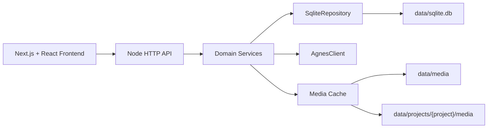

# 架构设计与开发指南

> **领域归属**：[上下文映射](../domain/04-context-map.md) + [公共领域基础设施](../domain/07-infrastructure.md) + [依赖方向约束](../domain/09-dependency-rules.md)

> 领域边界、聚合、事件、状态机以 [DDD 领域需求规格](../domain/01-domain-requirements-spec.md) 为权威来源。本文档描述**技术实现层**的架构、技术栈、项目结构、存储方案和开发排错指南。

---

## 目录

- [一、当前交付架构设计](#一当前交付架构设计)
- [二、技术栈](#二技术栈)
- [三、项目结构](#三项目结构)
- [四、存储方案](#四存储方案)
- [五、开发指南](#五开发指南)
- [六、领域-表映射](#六领域-表映射)
- [七、前端架构规范](#七前端架构规范)
- [八、并发控制规范](#八并发控制规范)
- [九、错误处理与响应规范](#九错误处理与响应规范)

---

## 一、当前交付架构设计

### 1.1 范围

本实现以需求规格说明书的正式产品 P0 范围为目标（以 [02-requirements-and-acceptance.md](../requirements/02-requirements-and-acceptance.md) 为准）。是否已经达到交付标准必须由 `docs/implementation/02-feature-status.md` 的代码、API、Schema 与自动化验收证据逐项确认：

- 项目管理（创建/归档/成员/权限）
- 剧本创作（文档管理/AI 分析/版本发布）
- 分镜导演（分镜板/分镜 CRUD/生成/送审）
- 资产库（角色/场景/道具 CRUD/回收站/批量/一致性包）
- AI 图片生成（文生图/图生图/历史/收藏/删除）
- AI 视频生成（异步任务/轮询/历史/收藏/删除）
- 审核质量（人工审核/自动质检）
- 发布交付（成片打包/发布计划/发布执行）
- 智能助手（对话会话/工作项/SSE 流式回复）
- 设置读取与更新
- 业务数据统一写入 SQLite（`backend/data/sqlite.db`），含软删除与字段级 schema 定义
- Web 端单页应用，PC 优先并适配窄屏

### 1.2 Agnes API 配置

服务启动时会读取项目根目录 `.env`。**必须**配置 `AGNES_API_KEY`（没有 Key 时启动即失败）。

```env
AGNES_API_KEY=你的_key
AGNES_API_BASE_URL=https://apihub.agnes-ai.com
```

如官方接口路径与默认值不同，可继续配置：

```env
AGNES_CHAT_PATH=/v1/chat/completions
AGNES_IMAGE_PATH=/v1/images/generations
AGNES_VIDEO_PATH=/v1/videos
AGNES_VIDEO_TASK_PATH=/agnesapi?video_id=:taskId
```

### 1.3 架构图



### 1.4 模块职责

| 模块 | 路径 | 职责 |
|------|------|------|
| HTTP路由 | `src/http/` | 路由、响应、SSE、静态资源、媒体文件访问 |
| 业务服务 | `src/services/` | 对话会话、图片、视频、收藏、项目、设置等业务逻辑 |
| 存储层 | `src/storage/` | SQLite 仓储抽象（Repository + SqliteRepository），表 schema 与 KV 设置 |
| AI层 | `src/ai/` | Agnes SDK 抽象与真实 API 实现 |
| 前端页面 | `frontend/app/` | Next.js 页面入口、图片详情页、视频详情页 |

### 1.5 核心设计原则

- **所有 AI 能力必须走真实 API**，未配置 `AGNES_API_KEY` 时 `createAgnesClient` 直接抛错，不提供任何本地模拟/兜底
- 业务数据统一存放在 SQLite，媒体文件使用本地文件系统
- 所有写入都通过参数化语句执行，避免 SQL 注入风险
- 模块化设计，支持后续功能扩展

---

## 二、技术栈

### 2.1 前端技术栈

| 技术 | 用途 |
|------|------|
| React 19 / Next.js (App Router) | UI框架 |
| TypeScript | 类型安全 |
| TailwindCSS | 样式系统 |
| Radix UI + 本地 UI 组件 | 组件基础设施 |
| Zustand | 客户端状态管理 |
| Fetch / 项目服务层 | HTTP 请求 |
| React Hook Form + Zod | 表单与校验 |

> 技术栈表只记录 `frontend/package.json` 中已安装并由代码使用的依赖；规划依赖不得提前写入本表。

### 2.2 后端技术栈

| 技术 | 用途 |
|------|------|
| Node.js 24.3.x | 运行时（项目使用 `node:sqlite`，由 `.nvmrc` 与 `engines` 锁定） |
| TypeScript | 类型安全 |
| node:sqlite (Node 24 内置) | SQLite 数据库（WAL 模式、参数化语句、软删除） |
| OpenAPI 3.0（目标门禁） | API 契约；生成和漂移校验按 [开发与交付规范](02-development-standards.md) |
| Pino | 结构化日志 |
| Node.js test runner | 后端单元与集成测试 |

### 2.3 AI SDK 统一封装（AgnesClient）

```ts
class AgnesClient {
  chat(params: ChatParams): AsyncIterable<ChatChunk>;
  generateImage(params: ImageParams): Promise<ImageResult>;
  generateVideo(params: VideoParams): Promise<{ taskId: string }>;
  queryTask(taskId: string): Promise<TaskStatus>;
  uploadFile(file: Buffer): Promise<{ url: string }>;
}
```

**能力**：
- 统一异常处理（重试 / 熔断 / 降级）
- 统一日志（调用耗时、Token、错误）
- 统一 Token 统计
- 自动重试（指数退避，最多 3 次）
- 超时控制

---

## 三、项目结构

### 3.1 根目录

| 目录/文件 | 说明 |
|-----------|------|
| `README.md` | 项目入口说明 |
| `start-all.bat` | 同时启动前端和后端 |
| `start-backend.bat` | 只启动后端 |
| `start-frontend.bat` | 只启动前端 |
| `backend/` | 后端代码和本地数据 |
| `frontend/` | 前端页面代码 |
| `docs/` | 设计、接口、存储和开发说明 |
| `scripts/` | 清理缓存、测试辅助等脚本 |

### 3.2 后端目录

| 文件/目录 | 职责 |
|-----------|------|
| `src/http/router.ts` | HTTP 入口，所有 API 路由 |
| `src/http/ai-tasks-router.ts` | AI 任务队列路由（任务管理、批量操作） |
| `src/http/data-router.ts` | 数据中心路由（成本统计、效率分析） |
| `src/http/models-router.ts` | 模型中心路由（模型列表、设置默认） |
| `src/http/publish-router.ts` | 发布中心路由（成片管理、发布计划） |
| `src/http/pipeline-router.ts` | 8 阶段生产流水线路由（状态机、阶段推断） |
| `src/services/domain.ts` | 核心业务逻辑（创建会话、生成图片、生成视频、项目管理） |
| `src/services/module-domain.ts` | 角色/场景/道具/分镜/音频/视频/剪辑等模块业务逻辑 |
| `src/services/script-center-impl.ts` | 剧本中心服务（剧本文档、剧集、场景、对白、AI 生成） |
| `src/services/media.ts` | 图片/视频下载缓存、上传图片保存、本地媒体读取 |
| `src/services/app.ts` | 创建后端运行上下文，组装 AI 客户端、SQLite 仓库、配置 |
| `src/ai/agnes-client.ts` | Agnes 官方接口适配层 |
| `src/storage/sqlite.ts` | 基于 `node:sqlite` 的仓储实现 |
| `src/storage/schema.ts` | 每张业务表的字段定义（FieldSpec） |
| `src/storage/csv-export.ts` | CSV 导出逻辑（RFC 4180） |
| `src/types.ts` | 后端核心数据类型 |
| `data/` | 运行时数据目录 |
| `tests/` | 后端测试 |

### 3.3 前端目录

| 文件/目录 | 职责 |
|-----------|------|
| `app/page.tsx` | 主对话页面（对话会话、图片、视频、收藏、项目列表） |
| `app/ai-tasks/page.tsx` | AI 任务队列页面 |
| `app/data/page.tsx` | 数据中心页面 |
| `app/models/page.tsx` | 模型中心页面 |
| `app/publish/page.tsx` | 发布中心页面 |
| `app/images/[id]/page.tsx` | 图片详情页 |
| `app/videos/[id]/page.tsx` | 视频详情页 |
| `components/dashboard/home-dashboard.tsx` | 驾驶舱（项目进度、核心指标、8 阶段流水线） |
| `components/conversation-sidebar.tsx` | 侧边栏导航 |
| `components/ui/` | 基础 UI 组件 |
| `tests/e2e/` | 端到端测试 |

### 3.4 代码阅读建议顺序

1. `README.md` —— 知道怎么运行
2. `docs/engineering/04-sqlite-plan.md` —— 知道数据放哪里
3. `backend/src/types.ts` —— 知道系统有哪些核心对象
4. `backend/src/http/router.ts` —— 知道接口怎么进来
5. `backend/src/services/domain.ts` —— 知道具体业务怎么做
6. `frontend/app/page.tsx` —— 知道页面怎么调用接口

---

## 四、存储方案

### 4.1 总览

运行时数据主要在 `backend/data/`：

- `backend/data/sqlite.db`：SQLite 主数据库（WAL 模式下附带 `sqlite.db-shm` / `sqlite.db-wal`）
- `backend/data/media/`：不属于某个项目的通用图片、视频、上传文件
- `backend/data/projects/`：每个项目自己的媒体目录
- `backend/data/logs/`：后端请求日志与审计日志

### 4.2 SQLite 数据

所有业务实体统一存放在一份 SQLite 数据库中。表结构与字段定义集中在 `backend/src/storage/schema.ts`。

**核心业务表**：

| 表名 | 用途 |
|------|------|
| `projects` | 项目基础信息与本地存储目录 |
| `conversations` | 对话会话 / 图片 / 视频生成会话 |
| `messages` | 对话消息 |
| `project_members` | 团队成员与职责分工 |
| `project_episodes` | 剧集规划 |
| `project_storyboards` | 分镜板 |
| `project_clips` | 剪辑清单 |
| `project_assets` | 项目资产库（图片 / 视频 / 角色 / 场景 / 风格 / Prompt 模板） |
| `project_versions` | 资产与剧本文档的版本历史 |
| `image_tasks` | 图片生成任务 |
| `video_tasks` | 视频生成任务 |
| `favorites` | 收藏记录 |
| `work_items` | 统一工作项（任务 / 问题 / 评审 / 里程碑） |
| `app_logs` | 业务审计日志 |
| `settings` | 应用设置（KV 形式） |

> **物理表与领域实体的对应关系**见 §6。领域层术语（Project、Episode、ScriptDocument、Storyboard、Shot、Character、Scene、Prop、Asset、FinalVideo、PublishPlan、PipelineRun、Review、QCReport、WorkItem、Conversation）以 [DDD 文档](../domain/01-domain-requirements-spec.md) §2 为准。

### 4.3 Repository 抽象

`backend/src/storage/repository.ts` 提供：

- `Repository<T extends { id: string; created_at: string }>`：标准 CRUD
- `KeyValueRepository<T>`：设置类实体
- `FieldSpec<T>`：把领域字段声明为 `string` / `number` / `boolean` / `json` 四种类型，由 `SqliteRepository<T>` 自动建表与读写

### 4.4 设计原则

- **存储介质**：单一 SQLite 数据库文件（WAL 模式）
- **引擎**：Node 24 自带 `node:sqlite`，参数化语句避免注入
- **连接释放**：HTTP server 关闭时调用 `ctx.close()`，释放 SQLite 连接
- **可移植性**：未来可平滑切换到 MySQL / Postgres，仅需替换 `SqliteRepository<T>` 实现

### 4.5 写入与并发安全

1. **参数化语句**：所有读写都通过 `?` 占位符，避免 SQL 注入
2. **WAL 模式**：读写并发不互斥，前端轮询与业务写入可以同时进行
3. **事务**：批量插入使用 `db.exec("BEGIN")` / `db.exec("COMMIT")` 包裹
4. **关闭释放**：`ctx.close()` 在 server 关闭时调用，避免 Windows 下文件被锁

### 4.6 软删除

所有业务表均带 `deleted_at` 字段。删除操作仅写入 `deleted_at` 时间戳，UI 仍可在"5 秒撤销"内恢复。真正物理删除需要走专门的管理接口。

### 4.7 项目目录

新建项目时：
- `新建空白项目`：后端自动生成一个项目目录
- `使用现有文件夹`：输入一个相对目录名，后端在 `backend/data/projects/` 下创建或复用它

项目目录结构：

```text
backend/data/projects/{项目目录}/
  media/
    images/
    videos/
  uploads/
```

项目记录里有两个字段：
- `storage_path`：项目目录相对路径
- `storage_mode`：`managed` 表示系统创建，`existing` 表示使用现有目录名

### 4.8 媒体文件访问

普通媒体 URL：
- `/media/images/...`
- `/media/videos/...`

项目媒体 URL：
- `/project-media/{projectId}/images/...`
- `/project-media/{projectId}/videos/...`

当图片或视频属于某个项目下的会话时，后端会优先缓存到该项目的 `media` 目录中。

### 4.9 用户下载导出

业务允许把分镜表、剪辑清单导出为 CSV 文件：
- `GET /api/projects/:id/exports/storyboards.csv`
- `GET /api/projects/:id/exports/edit-list.csv`

编码逻辑封装在 `backend/src/storage/csv-export.ts`，遵循 RFC 4180。

### 4.10 删除规则

删除历史会话时，会删除：
- 这个会话的消息记录
- 这个会话的图片任务记录
- 这个会话的视频任务记录
- 指向这些图片/视频任务的收藏记录

注意：如果后续要做"彻底删除物理文件"，需要在删除任务时同时清理 `media` 下的文件。当前重点是保证记录归属和页面不再展示。

### 4.11 备份与归档

| 周期 | 动作 |
|------|------|
| 每日 02:00 | `sqlite.db` → `sqlite.db.YYYY-MM-DD.bak` |
| 每周日 03:00 | 全量 tar 备份至 OSS / S3 |
| 实时 | 通过 `rclone` / `rsync` 同步至异地 |

---

## 五、开发指南

### 5.1 启动

推荐用根目录脚本：

```bat
start-all.bat
```

它会先检查端口占用，再启动：
- 后端：`http://localhost:3000`
- 前端：`http://localhost:3001`

单独启动：

```bat
start-backend.bat
start-frontend.bat
```

### 5.2 热更新

前端使用 Next.js 开发服务器，改 `frontend/app/page.tsx`、CSS、组件后通常会自动刷新。

后端当前是 TypeScript 编译后运行。改后端代码后需要重启后端，或者执行：

```bat
cd backend
npm run start:dev
```

### 5.3 验证

统一 Definition of Done、覆盖率目标和测试分层见 [开发与交付规范](02-development-standards.md)。本节命令是当前项目入口，不降低该规范的质量门禁。

后端测试：

```bat
cd backend
npm test
```

前端构建：

```bat
cd frontend
npm run build
```

完整验证：

```bat
cd backend
npm run test:all
```

### 5.4 日志

后端请求日志会写到：

```text
backend/data/logs/YYYY-MM-DD.log
```

如果前端报 `Failed to fetch`，先看：
1. 后端是否启动
2. 浏览器能否访问 `http://localhost:3000/api/conversations`
3. `backend/data/logs/` 里有没有错误堆栈

### 5.5 常见问题

**Unexpected token 'I', "Internal S"... is not valid JSON**

说明前端本来期待 JSON，但后端返回了 `Internal Server Error` 之类的 HTML 或纯文本。

先看后端终端和 `backend/data/logs/`，通常是后端抛错。

**Failed to proxy 或 socket hang up**

通常是后端进程崩了、端口不对，或者请求过程中后端重启。

先重启后端，再刷新前端页面。

**Next.js __webpack_modules__ 报错**

通常是 Next 缓存损坏。

处理方式：

```bat
node scripts\clean-next-cache.mjs
start-frontend.bat
```

**图片或视频生成失败**

检查：
1. `backend/.env` 是否有 `AGNES_API_KEY`
2. Agnes 接口路径是否和官方文档一致
3. 后端日志中真实接口返回的错误

### 5.6 改功能时看哪里

| 功能 | 文件位置 |
|------|----------|
| 页面布局 | `frontend/app/page.tsx` |
| 图片详情页 | `frontend/app/images/[id]/page.tsx` |
| 视频详情页 | `frontend/app/videos/[id]/page.tsx` |
| 接口路由 | `backend/src/http/router.ts` |
| 对话会话、图片、视频业务 | `backend/src/services/domain.ts` |
| 本地文件保存 | `backend/src/services/media.ts` |
| 数据库表字段 | `backend/src/storage/schema.ts` |
| SQLite 仓储实现 | `backend/src/storage/sqlite.ts` |
| 剧本中心业务 | `backend/src/services/script-center-impl.ts` |
| 模块业务（角色/场景/分镜等） | `backend/src/services/module-domain.ts` |
| CSV 导出 | `backend/src/storage/csv-export.ts` |

---

## 六、领域-表映射

> 领域层的聚合边界、事件、命令、不变量见 [DDD 领域需求规格](../domain/01-domain-requirements-spec.md) §3。本节给出**领域实体到物理表**的映射，便于阅读代码与文档互相对照。

### 6.1 命名约定

- **领域层**：使用 DDD 统一语言术语（PascalCase 聚合根、camelCase 字段），跨上下文共享同一术语
- **数据库层**：使用 `snake_case` 复数表名，`snake_case` 字段名，主键统一为 `TEXT`
- **物理表 `project_*` 前缀**：早期为项目隔离而保留的命名惯例，已统一在仓储层抽象，对上层透明

### 6.2 映射表

| 领域实体 | 物理表 | 所属上下文 |
|---------|--------|-----------|
| Project | `projects` | 项目管控 |
| Member | `project_members` | 项目管控 |
| Episode | `project_episodes` | 项目管控 |
| ScriptDocument | `project_versions` + `script_documents` 系列 | 剧本创作 |
| Storyboard | `project_storyboards` | 分镜导演 |
| Shot | `project_storyboards.shot_ids` + 派生快照 | 分镜导演 |
| Character | `characters` | 资产库 |
| Scene | `scenes` | 资产库 |
| Prop | `props` | 资产库 |
| AITask | `image_tasks` / `video_tasks`（按子类） | AI任务调度 |
| PipelineRun / PipelineNode | `pipeline_runs` / `pipeline_nodes` | AI任务调度 |
| Review / ReviewItem | `reviews` | 审核质量 |
| QCReport | `qc_reports` | 审核质量 |
| FinalVideo | `final_videos` | 发布交付 |
| PublishPlan / PublishRecord | `publish_plans` / `publish_records` | 发布交付 |
| Conversation / Message | `conversations` / `messages` | 智能助手 |
| WorkItem | `work_items` | 智能助手 |
| ModelConfig | `models` | AI任务调度 |
| PromptTemplate | `prompt_templates` | AI任务调度 |
| Dataset | `datasets` | AI任务调度 |
| EditProject / revision | `edit_projects` / `edit_project_revisions` | 后期制作 |
| AudioAsset / AudioTrack | `audio_assets` / `audio_tracks` | 后期制作 |
| SubtitleDocument / SubtitleCue | `subtitle_documents` / `subtitle_cues` | 后期制作 |
| RenderJob | `render_jobs` | 后期制作 |
| DomainEvent Outbox/Inbox/DLQ | `outbox_events` / `inbox_events` / `event_dlq` | 公共基础设施 |

### 6.3 跨实体引用

Shot 通过 `assetId + assetVersion` 引用 Character / Scene / Prop；EditProject 以 `sourceId + version` 引用分镜、音频和字幕。跨实体引用规则见 [依赖方向约束](../domain/09-dependency-rules.md)。

### 6.4 历史会话数据

| 物理表 | 用途 |
|--------|------|
| `conversations` | 对话会话/图片/视频会话（聚合于 AI 任务调用） |
| `messages` | 对话消息历史 |
| `favorites` | 收藏记录 |
| `settings` | 应用级 KV 设置 |
| `app_logs` | 业务审计日志 |

这些表用于"对话式 AI 创作"主路径，与项目化生产路径（`projects` / `episodes` / `storyboards` 等）共存，对应产品形态的两种入口。

---

## 七、前端架构规范

> **领域归属**：[上下文映射](../domain/04-context-map.md) + [模块-上下文映射表](../domain/06-module-map.md)
>
> 本节描述前端技术实现层的架构规范，包括组件分层、状态管理、路由设计与数据获取。前端技术栈见 [§2.1](#21-前端技术栈)，目录结构见 [§3.3](#33-前端目录)。

### 7.1 组件分层

前端按"路由层 → 页面层 → 业务组件层 → 通用组件层 → 基础设施层"自顶向下分层，每层只能依赖下层，禁止反向依赖。

| 层级 | 目录 | 职责 | 依赖规则 |
|------|------|------|----------|
| 路由层 | `app/` | Next.js App Router 页面入口与布局，负责路由匹配、参数解析、页面级数据装配 | 仅依赖页面层与布局层 |
| 布局层 | `app/layout.tsx`、`components/layout/` | 全局外壳（`LayoutShell`）、侧边栏、顶部导航、命令面板、错误边界、主题提供者 | 依赖通用组件层与基础设施层 |
| 页面层 | `app/<module>/page.tsx` | 单一模块的页面装配，组合业务组件并传入数据 | 依赖业务组件层与基础设施层 |
| 业务组件层 | `components/modules/`、`components/dashboard/`、`components/factory/`、`components/project/`、`components/chat/` | 按业务域组织的功能组件（剧本中心、角色工厂、流水线、驾驶舱等） | 依赖通用组件层与基础设施层 |
| 通用组件层 | `components/common/`、`components/ui/` | 与业务无关的可复用组件（Toast、确认弹窗、全局搜索、错误边界等） | 仅依赖基础设施层 |
| 基础设施层 | `lib/`、`hooks/` | API 客户端、状态 Store、自定义 Hook、工具函数、类型定义 | 无业务组件依赖 |

**分层约束**：

- 业务组件不得直接调用 `fetch`，必须通过 `lib/api-client.ts` 统一封装的请求方法。
- 通用组件不得引用业务类型（`lib/app-types.ts` 中的领域类型），保持可独立复用。
- `app/` 目录下的页面文件保持精简，复杂交互逻辑下沉到 `components/` 对应业务组件。

### 7.2 状态管理

前端状态分为三类，分别由不同机制管理，职责互不交叉：

| 状态类别 | 管理机制 | 存放位置 | 适用场景 |
|----------|----------|----------|----------|
| 服务端状态 | API 客户端缓存 + 组件局部 state | `lib/api-client.ts`（GET 缓存 15s） | 列表数据、详情数据等来自后端的数据 |
| 全局客户端状态 | Zustand Store | `lib/stores/` | 跨页面共享的 UI 状态（当前选中项目、工厂选中态、主题、剧本编辑态、分镜展开态） |
| 局部 UI 状态 | React `useState` / `useEffect` | 组件内部 | 单组件内的临时状态（弹窗开关、表单输入、加载态） |

**Zustand Store 规范**：

- 所有全局 Store 统一放在 `lib/stores/` 目录，通过 `lib/stores/index.ts` 统一导出。
- 需要持久化的 Store 使用 `zustand/middleware` 的 `persist` 中间件，指定明确的 `localStorage` key。
- Store 内只保存 UI 状态与少量派生数据，不缓存业务实体列表（业务列表走服务端状态）。
- 当前全局 Store 清单：`useProjectStore`（项目选择）、`useFactorySelectionStore`（工厂选中态）、`useScriptStore`（剧本编辑）、`useThemeStore`（主题）、`useStoryboardExpandedStore`（分镜展开态）。

**数据获取规范**：

- 业务数据模块（角色 / 场景 / 道具 / 分镜 / 视频 / 音频 / 剪辑）统一使用 `useFactoryEntity` Hook + `<FactoryCRUDPage>` 组合，封装在 `components/factory/`。
- `useFactoryEntity` 负责按当前选中项目加载实体列表、管理选中态、同步到 `useFactorySelectionStore` 供跨组件消费。
- 已废弃的 `useModuleCrud` Hook 仅保留给无 `project_id` 维度的系统级配置模块使用，新模块不得引用。
- 写操作（POST / PUT / DELETE）完成后调用 `clearApiCache()` 清除 GET 缓存，保证下次读取拿到最新数据。

### 7.3 路由设计

前端使用 Next.js App Router，路由文件放在 `app/` 目录，遵循文件系统路由约定。

**路由组织**：

| 路由模式 | 路径示例 | 说明 |
|----------|----------|------|
| 列表页 | `app/characters/page.tsx` | 模块主入口，展示实体列表与工厂操作 |
| 详情页（动态路由） | `app/characters/[id]/edit/page.tsx` | 独占式编辑页，仅保留顶部导航 |
| 子功能页 | `app/characters/[id]/consistency-pack/page.tsx` | 一致性包等实体子功能 |
| 流水线详情 | `app/pipeline/runs/[runId]/page.tsx` | 流水线执行实例详情 |
| 嵌套布局 | `app/scripts/layout.tsx` | 剧本模块共享布局 |

**布局规范**：

- 根布局 `app/layout.tsx` 组装全局外壳链：`BrowserCompatibilityBanner` → `ErrorBoundary` → `ThemeProvider` → `LayoutShell` → 全局浮层（Toast / 确认弹窗 / 新手引导 / 帮助中心）。
- 工作台型页面（驾驶舱、数据中心等）渲染完整侧边栏 + 顶部导航；独占式编辑页（剧本编辑、角色 / 道具编辑）只保留顶部导航，最大化编辑区域。
- 主题在 hydration 前通过内联脚本同步写入 `<html>` class，避免初次渲染闪烁。

**错误边界**：

- 根布局包裹 `ErrorBoundary`，捕获子组件渲染错误并显示降级 UI，避免整页白屏。
- 路由级错误由 Next.js 内置错误处理兜底，业务组件内部对异步错误做 try-catch 并通过 Toast 提示。

---

## 八、并发控制规范

> **领域归属**：[公共领域基础设施](../domain/07-infrastructure.md) + [依赖方向约束](../domain/09-dependency-rules.md)
>
> 本节描述后端在数据写入、聚合更新、AI 任务执行等场景下的并发控制规范。领域层的乐观并发契约（`AggregateRoot.version`、`AggregateRepository.save(expectedVersion)`、`IdempotencyKeyProvider`）以 [公共领域基础设施](../domain/07-infrastructure.md) 为权威来源；本节描述技术实现层的落地方式。基础并发安全（WAL 模式、参数化语句、连接释放）见 [§4.5](#45-写入与并发安全)。

### 8.1 数据库事务

跨仓储的原子写入通过 `TransactionService`（`backend/src/services/horizontal/transaction-service.ts`）统一管理，遵循事务 + Outbox 模式。

**事务边界**：

- 需要同时修改多个聚合或"先改状态、再发事件"的两步操作，必须包裹在 `TransactionService.run(fn)` 中，回调内所有仓储操作在同一 SQLite 连接上串行执行，要么全部提交、要么全部回滚。
- 事务通过 `db.exec("BEGIN")` / `db.exec("COMMIT")` / `db.exec("ROLLBACK")` 控制；回调抛错时自动回滚。
- 事务内若发生进程级未捕获异常，通过 `process.once("uncaughtException", finalize)` 兜底回滚，防止事务悬挂。

**Outbox 事件模式**：

- 跨模块领域事件通过 `TransactionContext.enqueueOutboxEvent(event)` 在事务内写入 `outbox_events` 表，与业务写入原子提交，保证"事件不会孤立于业务状态"。
- 后台 Dispatcher 周期性（默认 2s）拉取 `status=pending` 的事件并分发；分发失败递增 `attempts`，达到 `max_attempts`（默认 5）后置为 `dead` 终态，运维可重放。
- 进程崩溃时，下次启动 Dispatcher 重新拉取所有 pending 事件，保证最终一致。

**Unit of Work**：

- `UnitOfWork`（`backend/src/application/shared/unit-of-work.ts`）在应用层封装事务边界，命令处理器通过 `unitOfWork.run(context => ...)` 执行，回调内通过 `context.enqueueDomainEvent()` 追加领域事件，事件在事务提交后转为 Outbox 事件分发。

### 8.2 乐观锁

聚合的并发更新通过乐观锁（Optimistic Concurrency Control）保护，避免多个请求并发修改同一聚合产生丢失更新。

**机制**：

- 每个聚合根持有单调递增的 `version` 字段（`AggregateRoot.version`）。
- 仓储的 `save(aggregate, expectedVersion)` 方法在持久化时校验当前数据库中的版本与 `expectedVersion` 一致；不一致时抛出 `DomainError`，错误码为 `aggregate_version_conflict`（HTTP 409）。
- 命令处理器在加载聚合后记录当前 `version`，执行业务逻辑后以该 `version` 作为 `expectedVersion` 调用 `save`。

**冲突处理**：

- 前端收到 409 时应提示"数据已被他人修改，请刷新后重试"，不得静默覆盖。
- `EventStore.append(events, expectedVersion)` 同样基于版本号做乐观并发控制，事件追加与状态变更在同一事务内完成。

### 8.3 幂等性

对可能重复执行的命令（如前端重试、流水线节点重试），通过幂等键保证同一业务意图只产生一次副作用。

**幂等键计算**：

- `computeNodeIdempotencyKey`（`backend/src/services/module-domain/pipeline-idempotency.ts`）按"节点类型 + 项目 ID + 归一化输入 + 配置"计算 SHA-256 前 16 位作为幂等键。
- 输入归一化使用字段白名单（`IDEMPOTENT_INPUT_KEYS`），过滤无关字段抖动；JSON 序列化按键名字典序排序（`stableStringify`），保证相同语义输入产出相同键。
- `wait` / `delay` 节点无业务计算结果，返回空串不参与幂等复用。

**命令幂等**：

- `DomainCommand` 携带 `commandId` 与可选 `idempotencyKey`（`CommandMetadata`），由 `IdempotencyKeyProvider` 统一计算与校验。
- 已处理的命令通过 `isProcessed(commandId)` 判定；重复提交时返回首次处理结果，并抛出 `command_already_processed`（HTTP 409），而非重复执行。

### 8.4 并发限流

AI 任务执行通过进程内并发追踪器限制同类型节点的并行实例数，避免后端被 AI 调用打爆。

**机制**（`ConcurrencyTracker`，`backend/src/services/horizontal/concurrency-tracker.ts`）：

- 按节点类型维护运行计数与等待队列；`acquire(type, max)` 申请槽位，`release(token)` 释放。
- 当前运行数达到上限时，请求挂入等待队列，槽位释放后按 FIFO 唤醒队首。
- 等待超过 5 分钟强制放行（fail-open），避免永久卡住；最坏情况是临时超出上限一次（可接受）。
- 计数器为进程内内存状态，不持久化；进程崩溃后计数归零。

**上限解析优先级**（`getNodeMaxConcurrent`，高 → 低）：

1. 节点 `config.max_concurrent`（显式指定）
2. Run `workflow_config.max_concurrent_by_type[type]`（Run 级策略）
3. `DEFAULT_MAX_CONCURRENT[type]`（全局默认，如图片生成 3、视频生成 2）
4. 兜底 3

上限保护值 100，防止恶意配置耗尽资源。

---

## 九、错误处理与响应规范

> **领域归属**：[公共领域基础设施](../domain/07-infrastructure.md) + [上下文映射](../domain/04-context-map.md)
>
> 本节描述后端 HTTP 层的统一错误处理与响应规范。项目不使用 Express / Koa 中间件链，而是在 Node 原生 HTTP 服务器中通过集中式错误处理函数 + 顶层 try-catch 兜底实现等价能力。领域错误码契约以 [公共领域基础设施](../domain/07-infrastructure.md) 为权威来源。

### 9.1 统一响应格式

所有 API 响应统一为 JSON 格式，由 `sendJson` / `sendError`（`backend/src/http/http-utils.ts` 与 `router.ts`）封装：

**成功响应**：

```json
{ "code": 0, "message": "ok", "data": <任意可序列化结构> }
```

**错误响应**：

```json
{ "code": <业务错误码>, "message": "<人类可读消息>", "data": <错误详情或null> }
```

- `Content-Type` 固定为 `application/json; charset=utf-8`。
- 领域错误（`DomainError`）的 `data` 字段携带 `details`；普通错误的 `data` 为 `null`。

### 9.2 错误分层与映射

错误按来源分三层，每层有明确的 HTTP 状态码与业务错误码映射规则：

| 错误层 | 来源 | HTTP 状态码 | 业务错误码 | 处理方式 |
|--------|------|------------|-----------|----------|
| 领域错误 | `DomainError`（`domain/shared/domain-error.ts`） | 由 `domainErrorHttpStatus` 映射 | `error.code`（领域错误码字符串） | `sendDomainError` 优先识别并透传 |
| 业务错误 | 带 `status` 属性的 Error（如预算超支、鉴权） | 透传 `error.status`（限 400-499） | `errorCodeForStatus(status)` | 顶层 catch 透传 HTTP 状态码 |
| 已知消息错误 | 无 status 但消息匹配已知错误码（如 `project_not_found`） | `errorStatusForMessage` 推导 | 对应错误码 | 顶层 catch 推导状态码 |
| 兜底错误 | 未分类的异常 | 400（默认）或 500 | `1005`（服务器内部错误） | 顶层 catch 兜底 |

**领域错误码 → HTTP 状态码映射**（`domainErrorHttpStatus`）：

| 领域错误码 | HTTP 状态码 | 含义 |
|-----------|------------|------|
| `aggregate_not_found` | 404 | 聚合不存在 |
| `invalid_state_transition` | 409 | 非法状态迁移 |
| `aggregate_version_conflict` | 409 | 乐观锁版本冲突 |
| `command_already_processed` | 409 | 命令重复提交 |
| `aggregate_invariant_violated` | 422 | 聚合不变量违反 |

**HTTP 状态码 → 业务错误码映射**（`errorCodeForStatus`）：

| HTTP 状态码 | 业务错误码 | 含义 |
|------------|-----------|------|
| 400 | 1002 | 请求参数错误 |
| 401 / 403 | 1003 | 未授权 / 禁止访问 |
| 402 | 1010 | 预算超支 |
| 404 | 1004 | 资源不存在 |
| 409 | 1008 | 状态冲突 |
| 422 | 1007 | 入参校验失败 |
| 429 | — | 请求过于频繁（限流） |
| 504 | 1006 | 上游 AI 服务超时 |
| ≥500 | 1005 | 服务器内部错误 |

### 9.3 错误处理流程

HTTP 请求的错误处理分为两层 catch，由内到外兜底：

**第一层（`handleRequest` 内 try-catch）**：

- 捕获路由分发过程中的所有异常。
- `TimeoutError` → 504（区分"AI 排队慢"与"服务故障"）。
- 带 `status`（400-499）的业务错误 → 透传 HTTP 状态码。
- 已知消息错误 → `errorStatusForMessage` 推导状态码。
- 其余 → `sendError(res, error)` 默认 400。

**第二层（`createServer` 的 `.catch`）**：

- 捕获第一层未处理的异常（如 SSE 流式回调抛错）。
- `TimeoutError` → 504，响应体携带 `timeoutMs` 与 `operation`。
- 带 `status`（400-499）→ 透传并记录 `warn` 日志。
- 其余 → 500，响应体携带 `traceId` 供排查，记录 `error` 日志。
- 所有响应写入前检查 `res.headersSent`，避免对已发送响应头的请求二次写入导致崩溃。

### 9.4 特殊场景处理

**SSE 流式响应**：

- SSE 响应头一旦发出，后续流式回调中的异常**不能**再走顶层 catch 写 500（此时 header 已发出，写入会崩溃）。
- SSE handler 内部自行 try-catch，错误只记录日志、不重抛，避免冒泡到顶层。

**请求体解析**：

- `readJsonBody`（`http-utils.ts`）限制请求体最大 1MB，超限抛 `HttpBodyError`（413，`BODY_TOO_LARGE`）。
- JSON 格式错误抛 `HttpBodyError`（400，`INVALID_JSON`）。

**限流**：

- `EndpointRateLimiter` 按端点 + 用户维度限流，触发时返回 429 并设置 `Retry-After` 响应头。
- 响应头携带 `x-ratelimit-limit` 与 `x-ratelimit-remaining`。

### 9.5 可观测性

- 每个请求生成 `traceId`（优先取请求头 `x-request-id`，否则生成 `tr-<uuid>`），通过 `AsyncLocalStorage` 绑定到日志上下文，业务内任意 `logger.child()` 自动携带。
- 响应头回写 `x-request-id`，前端可凭此关联后端日志。
- 请求开始与结束均记录结构化日志（`http.request.start` / `http.request`），包含方法、路径、状态码、耗时、生命周期（正常结束 / 连接中断）。
- 状态码 ≥500 记录 `error` 级别，400-499 记录 `warn`，其余 `info`。
- `debug` 级别下通过 `attachDebugHook` 捕获请求 / 响应体（脱敏 + 截断），用于排查问题。
