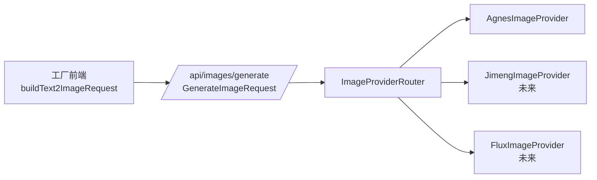

# 三个工厂（角色 / 场景 / 道具）— 资产图片多视图契约

> **适用范围**: `/characters` `/scenes` `/props` 三个工厂模块的"列表 + 编辑 + 多视图 + AI 生图"。
> **所属上下文**: 资产库上下文（详见 [DDD 文档 §3.4](ddd/domain-requirements-spec.md)）；聚合根为 `CharacterImageHistory` / `SceneImageHistory` / `PropImageHistory`，归属于 `Character` / `Scene` / `Prop` 聚合的引用对象集合。
> **约束**: 本文档是后端 API、前端 service / 组件、数据库 schema、测试用例的**唯一真相源**。任一处代码与本文档不一致，以本文档为准，先改文档再改代码。

---

## 0. 文档使用约定

- 任何字段增删、API 路径变更、状态机调整、默认值变化 → **先改本文档** → 复核 → 再改代码。
- 评审冲突时，引用本文档的字段表 / 状态机段落作为唯一依据。
- 字段命名同时给出 `snake_case`（后端/DB）和 `camelCase`（前端）两种，禁止混用。

---

## 1. 目标与范围

### 1.1 业务目标

AI 漫剧的同一角色/场景/道具会生成大量图片（多景别、多角度、不同用途），其中：

- **可作资产的图**：定妆照、表情库、动作库、场景适配图、道具多角度。
- **不可作资产的图**：失败的试错图、临时的分镜草图、参考图。

本契约定义：**一个工厂实体（character / scene / prop）下挂多张图片的管理、筛选、生成、复用机制**。

### 1.2 范围

- 数据库 schema（`character_image_history` / `scene_image_history` / `prop_image_history`）。
- 后端 API 路径、动词、字段、错误码。
- 前端 service（`asset-image.service.ts`）的全部函数与类型。
- 前端 AI 生图对话框的请求体结构。
- 前端 UI 组件清单（`AssetImageManager` 抽屉 + AI 对话框 + 卡片入口）。

### 1.3 设计原则

| # | 原则 | 落地 |
|---|------|------|
| 1 | **资产分层** | `is_applied` 区分"已设为资产"（永久保留） vs "历史"（可由用户主动删除）。 |
| 2 | **筛选维度可加** | 景别 / 角度 / 视图类型三个维度独立索引，可单独筛、组合筛。 |
| 3 | **图生图必选参考图** | `image2image` 模式必须传 `image[]`，前端校验。 |
| 4 | **AI 参数单一真相源** | `frontend/lib/image-config.ts` 是后端 / 前端 / 文档任何不一致的最终依据。 |
| 5 | **三厂同构** | 共用 `AssetImageManager` 抽屉，通过 `entityType` 切换维度默认值。 |
| 6 | **乐观更新 + 失败回滚** | 列表操作乐观更新，API 失败时回滚并 toast。 |
| 7 | **失败显式** | AI 生图失败不伪造资产，前端不展示空 URL 的卡片。 |

---

## 2. 数据模型

### 2.1 三厂图片历史表（同构）

三张表字段完全一致，只把"主键外键"字段名换为 `character_id` / `scene_id` / `prop_id`：

```sql
CREATE TABLE character_image_history (
  id              TEXT PRIMARY KEY,
  character_id    TEXT NOT NULL,
  project_id      TEXT NOT NULL,

  -- 图片本体
  url             TEXT NOT NULL,
  ratio           TEXT,                    -- 例 "9:16" / "16:9" / "1:1"
  model           TEXT,                    -- 例 "agnes-image-2.1-flash"
  size            TEXT,                    -- 例 "768x1152"
  response_format TEXT DEFAULT 'url',      -- "url" | "b64_json"
  n               INTEGER DEFAULT 1,       -- 当次生成的候选数

  -- 生成参数
  prompt              TEXT,
  negative_prompt     TEXT,
  reference_image_url TEXT,                -- 图生图的参考图（nullable）

  -- 多视图维度
  shot_type           TEXT,                -- 景别
  angle               TEXT,                -- 角度
  view_type           TEXT,                -- 视图类型：角色 costume|expression|action|scene_fit；场景 overall|detail|transition；道具 single|multi_angle|usage

  -- 状态
  is_applied       INTEGER DEFAULT 0,      -- 0=历史, 1=已设为资产
  applied_at       TEXT,
  is_primary       INTEGER DEFAULT 0,      -- 是否主图（一个实体下唯一）
  created_at       TEXT NOT NULL
);

CREATE INDEX idx_char_image_history_entity ON character_image_history(character_id, created_at DESC);
CREATE INDEX idx_char_image_history_filter ON character_image_history(character_id, shot_type, angle, view_type);
```

`scene_image_history` / `prop_image_history` 同构，索引列名对应改为 `scene_id` / `prop_id`。

### 2.2 字段枚举值

#### shot_type（景别）— 三厂共用

| 值 | 中文 | 用途 |
|---|---|---|
| `extreme_long` | 远景 | 强调环境、角色极小 |
| `long` | 全景 | 全身 + 环境 |
| `medium` | 中景 | 膝盖以上 |
| `medium_close` | 近景 | 胸部以上 |
| `close` | 特写 | 面部 / 物体局部 |
| `bust` | 半身 | 腰部以上 |
| `full` | 全身 | 完整角色 |

#### angle（角度）— 三厂共用

| 值 | 中文 |
|---|---|
| `front` | 正面 |
| `side` | 侧面 |
| `back` | 背面 |
| `three_quarter` | 3/4 侧 |
| `top` | 俯视 |
| `bottom` | 仰视 |
| `bird` | 鸟瞰 |

#### view_type — 三厂不同

**角色**：

| 值 | 中文 |
|---|---|
| `costume` | 定妆 |
| `expression` | 表情（实际写库使用 `expression:<name>` 命名空间，如 `expression:neutral` / `expression:smile`，避免一致性包 reuse 时与 `costume` 维度冲突） |
| `action` | 动作 |
| `scene_fit` | 场景适配 |

**场景**：

| 值 | 中文 |
|---|---|
| `overall` | 整体 |
| `detail` | 细节 |
| `transition` | 转场 |

**道具**：

| 值 | 中文 |
|---|---|
| `single` | 单件 |
| `multi_angle` | 多角度 |
| `usage` | 使用场景 |

### 2.3 与其他表的关系

| 表 | 关系 | 备注 |
|---|---|---|
| `characters` / `scenes` / `props` | N:1（`character_id` 外键） | 实体删除时级联删除图片历史 |
| `images`（公共图库） | 无强约束 | history 表 url 可与 images.id 对应（可选） |

---

## 3. 后端 API 契约

### 3.1 通用约定

- 路径前缀：`/api/characters/:id/images`（角色）/ `/api/scenes/:id/images`（场景）/ `/api/props/:id/images`（道具）。
- 请求体：JSON。
- 响应：标准 envelope `{ "code": 0, "message": "ok", "data": ... }`。
- 错误：`code` 非 0 + `message`，HTTP 状态码语义保持（404 / 400 / 403 / 500）。
- 鉴权：与父实体一致（`/api/characters/:id` 走 RBAC，project member 才能访问）。
- 角色（RBAC）：viewer+ 读、editor+ 写。

### 3.2 角色图片 6 端点（场景 / 道具同构）

| 动词 | 路径 | 请求体 | 成功响应 | 错误码 |
|---|---|---|---|---|
| GET | `/api/characters/:id/images` | query: `shot_type?` `angle?` `view_type?` `is_applied?` `is_primary?` | `AssetImage[]` | 404 / 403 |
| POST | `/api/characters/:id/images` | 见 §3.3 | `AssetImage` | 400 / 403 / 404 |
| PATCH | `/api/characters/:id/images/:imgId` | `Partial<AssetImage>` | `AssetImage` | 404 / 403 |
| DELETE | `/api/characters/:id/images/:imgId` | — | `{ deleted: true }` | 404 / 403 |
| PUT | `/api/characters/:id/images/:imgId/primary` | — | `AssetImage`（同时把同实体其他图 `is_primary=0`） | 404 / 403 |
| POST | `/api/characters/:id/images/:imgId/apply` | — | `AssetImage`（`is_applied=1`） | 404 / 403 |

### 3.3 AssetImage 数据结构

```ts
interface AssetImage {
  id: string;
  url: string;
  project_id: string;
  character_id: string;          // 角色；场景为 scene_id，道具为 prop_id
  ratio: string;                  // "9:16" 等
  model: string;                  // "agnes-image-2.1-flash"
  size: string;                   // "768x1152"
  response_format: "url" | "b64_json";
  n: number;
  prompt: string;
  negative_prompt: string;
  reference_image_url: string | null;
  shot_type: ShotType | null;
  angle: Angle | null;
  view_type: ViewType;            // 默认值：角色 "costume"，场景 "overall"，道具 "single"
  is_applied: 0 | 1;
  applied_at: string;
  is_primary: 0 | 1;
  created_at: string;             // ISO 8601
}
```

### 3.4 POST 请求体（创建）

```jsonc
{
  "url": "https://cdn.../image.png",     // 必填
  "prompt": "古风少年剑客...",             // 必填
  "model": "agnes-image-2.1-flash",       // 必填，默认值见 §6
  "size": "768x1152",                     // 必填
  "ratio": "9:16",                        // 必填
  "response_format": "url",               // 默认 "url"
  "n": 1,                                  // 默认 1
  "negative_prompt": "",                   // 可选
  "reference_image_url": null,             // 图生图时必填
  "shot_type": "medium",                   // 可选
  "angle": "front",                        // 可选
  "view_type": "costume"                   // 必填
}
```

### 3.5 错误码

| code | message | 触发条件 |
|---|---|---|
| 40001 | `invalid filter: shot_type must be one of [...]` | 筛选值非法 |
| 40002 | `reference_image_url is required for image2image` | `reference_image_url` 为空但 model 含 `i2i` |
| 40003 | `at most one primary image per entity` | 设主图时同实体已有其他主图（自动取消其他） |
| 40401 | `character not found` | `:id` 不存在 |
| 40402 | `image not found` | `:imgId` 不存在 |
| 40301 | `no project access` | RBAC 拒绝 |

---

## 4. 前端契约

### 4.1 service：`frontend/services/asset-image.service.ts`

```ts
// ============ 类型 ============
export type ShotType =
  | "extreme_long" | "long" | "medium" | "medium_close"
  | "close" | "bust" | "full";

export type Angle =
  | "front" | "side" | "back" | "three_quarter"
  | "top" | "bottom" | "bird";

export type CharacterViewType = "costume" | "expression" | "action" | "scene_fit";
export type SceneViewType     = "overall" | "detail" | "transition";
export type PropViewType      = "single" | "multi_angle" | "usage";

export type ViewType = CharacterViewType | SceneViewType | PropViewType;

export type EntityTypeForImages = "character" | "scene" | "prop";

export interface AssetImage {
  id: string;
  url: string;
  project_id?: string;
  character_id?: string;
  scene_id?: string;
  prop_id?: string;
  ratio?: string;
  model?: string;
  size?: string;
  response_format?: "url" | "b64_json";
  n?: number;
  prompt?: string;
  negative_prompt?: string;
  reference_image_url?: string | null;
  shot_type?: ShotType | null;
  angle?: Angle | null;
  view_type?: ViewType;
  is_applied?: 0 | 1;
  applied_at?: string;
  is_primary?: 0 | 1;
  created_at?: string;
}

export interface AssetImageFilters {
  shot_type?: ShotType;
  angle?: Angle;
  view_type?: ViewType;
  is_applied?: 0 | 1;
  is_primary?: 0 | 1;
}

// ============ 列表 + 筛选 ============
export function listCharacterImages(
  id: string,
  filters?: AssetImageFilters,
): Promise<AssetImage[]>;
export function listSceneImages(
  id: string,
  filters?: AssetImageFilters,
): Promise<AssetImage[]>;
export function listPropImages(
  id: string,
  filters?: AssetImageFilters,
): Promise<AssetImage[]>;

// ============ 创建 ============
export function createCharacterImage(
  id: string,
  body: Omit<AssetImage, "id" | "created_at" | "is_applied" | "is_primary">,
): Promise<AssetImage>;
// scene / prop 同构

// ============ 改 meta（PATCH）============
export function updateCharacterImage(
  id: string,
  imageId: string,
  patch: Partial<Pick<AssetImage, "shot_type" | "angle" | "view_type" | "prompt" | "negative_prompt">>,
): Promise<AssetImage>;
// scene / prop 同构

// ============ 删除 ============
export function deleteCharacterImage(id: string, imageId: string): Promise<void>;
// scene / prop 同构

// ============ 设主图 ============
export function setPrimaryCharacterImage(id: string, imageId: string): Promise<AssetImage>;
// scene / prop 同构

// ============ 标记为资产 ============
export function applyCharacterImage(id: string, imageId: string): Promise<AssetImage>;
// scene / prop 同构

// ============ 辅助函数 ============
export function pickPrimaryImage(images: AssetImage[] | null | undefined): AssetImage | undefined;
export function getDefaultViewType(entity: EntityTypeForImages): ViewType;
export function getDefaultRatio(entity: EntityTypeForImages): string;
```

### 4.2 组件清单

| 组件 | 路径 | 职责 |
|---|---|---|
| `AssetImageManager` | `frontend/components/factory/asset-image-manager.tsx` | 右侧抽屉，完整管理某实体的所有图片（核心 UI） |
| `AIGenerateImageDialog` | `frontend/components/shared/ai-generate-dialog.tsx` | AI 生图对话框（升级为双模式 + 高级参数） |
| `AssetImageFilterPanel` | `frontend/components/factory/parts/asset-image-filter-panel.tsx` | 抽屉内 3 维筛选面板 |
| `AssetImageGrid` | `frontend/components/factory/parts/asset-image-grid.tsx` | 图片网格（卡片 + 悬浮操作） |
| `AssetImageCard` | `frontend/components/factory/parts/asset-image-card.tsx` | 单图卡片 |
| `AssetImageMetaDrawer` | `frontend/components/factory/parts/asset-image-meta-drawer.tsx` | 改 meta 小抽屉（景别/角度/视图类型） |

### 4.3 触发入口

| 入口位置 | 触发方式 | 行为 |
|---|---|---|
| 角色卡片悬浮 | **"📚 资产库"** 按钮 | 打开 `AssetImageManager entityType="character"` |
| 场景卡片悬浮 | **"📚 资产库"** 按钮 | 打开 `AssetImageManager entityType="scene"` |
| 道具卡片悬浮 | **"📚 资产库"** 按钮 | 打开 `AssetImageManager entityType="prop"` |
| 角色卡片悬浮 | **"🎨 风格锚定"** 按钮 | 跳 `/characters/[id]/consistency-pack` |
| 场景卡片悬浮 | **"🎨 风格锚定"** 按钮 | 跳 `/scenes/[id]/consistency-pack` |
| 道具卡片悬浮 | **"🎨 风格锚定"** 按钮 | 跳 `/props/[id]/consistency-pack` |
| 角色编辑页（独立路由） | 升级：抽屉嵌入右侧栏 | 保留 `/characters/[id]/edit` 但内容改为 `AssetImageManager` |
| AI 生成对话框 | "✓ 确认创建" | 成功后写 history，跳"设置 meta"小弹窗 |

**按钮文案与图标约束**：

- 三个工厂（角色 / 场景 / 道具）的所有按钮、卡片、操作入口**不使用 SVG 图标**，一律使用 **Emoji + 纯文字** 组合。
- 理由：避免图标库版本漂移 / 体积膨胀 / 跨平台不一致；emoji 在所有平台（Web / Windows / macOS / 移动端）自带渲染。
- 影响范围：所有工厂相关的按钮、卡片头部、操作菜单、状态指示、Tab 标签。
- 已有 SVG 图标（如 `lucide-react` 的 Pencil / Trash2 / ImageIcon / Wand2 / Copy / Loader2 等）从这些模块全部移除，改为对应 emoji：
  - 编辑：✏️
  - 删除：🗑
  - 资产库：📚
  - 风格锚定：🎨
  - AI 生成：🪄
  - 复制到其他项目：📋
  - 加载中：⏳（不旋转，配合文字"加载中…"）
  - 上传：📤
  - 下载：📥
  - 筛选：🔍
  - 重置：↻
  - 确认：✓
  - 取消：✕
  - 警告：⚠
  - 成功：✅
  - 失败：❌
  - 主图：⭐
  - 设为主图：☆→⭐
  - 多选勾选：☑ / ☐
- 文档、UX 文本、按钮 title 提示也按 emoji 优先。

---

## 5. AI 生图契约

### 5.1 单一真相源：`frontend/lib/image-config.ts`

```ts
// 单一真相源；后端 / 前端 / 文档任何不一致以此处为准
export const DEFAULT_IMAGE_MODEL = "agnes-image-2.1-flash";
export const DEFAULT_RESPONSE_FORMAT: "url" = "url";

export const ENTITY_DEFAULT_RATIO: Record<"character" | "scene" | "prop", string> = {
  character: "9:16",  // 角色竖屏
  scene:     "16:9",  // 环境横屏
  prop:      "1:1",   // 道具方形
};

export const ENTITY_DEFAULT_SIZE: Record<"character" | "scene" | "prop", string> = {
  character: "768x1152",
  scene:     "1280x720",
  prop:      "1024x1024",
};

export const SUPPORTED_RATIOS = [
  "9:16", "16:9", "1:1", "4:3", "3:4", "2:3", "3:2",
] as const;

export const SUPPORTED_N = [1, 2, 3, 4] as const;

export const DEFAULT_N = 4;  // 候选图默认 4 张

export interface GenerateImageRequest {
  model: typeof DEFAULT_IMAGE_MODEL;
  prompt: string;
  size: string;
  ratio: string;
  n: number;
  extra_body: { response_format: "url" };  // 文档要求：response_format 必须在 extra_body 内
  // 仅图生图：
  image?: string[];
  // 仅高级：
  negative_prompt?: string;
}
```

### 5.2 双模式（文生图 / 图生图）

```ts
export type GenerateMode = "text2image" | "image2image";

export interface Text2ImageConfig {
  prompt: string;
  ratio: string;
  size: string;
  n: number;
  style?: string;  // 可选：写实/动漫/古风/科幻
}

export interface Image2ImageConfig extends Omit<Text2ImageConfig, "style"> {
  referenceImageUrl: string;  // 必填
  strength: number;            // 0~1，默认 0.6
}
```

**前端约束**：

- `image2image` 模式下 `referenceImageUrl` 必填，前端在提交前校验。
- `n` 默认 4，范围 1~4。
- `size` 与 `ratio` 联动（同一比例对应同一 size 模板）。

### 5.3 高级参数（折叠区）

| 参数 | 范围 | 默认 | 适用模式 |
|---|---|---|---|
| `negative_prompt` | string | `""` | 两者 |
| `style` | enum | `""` | 仅 text2image |
| `strength` | 0.0-1.0 | 0.6 | 仅 image2image |
| `seed` | integer | 随机 | 两者（可复现） |

### 5.4 调用约束

- **失败显式**：AI 生成失败时返回错误，不返回空 `image_urls`；前端 catch 后不写 history。
- **超时**：单次生成 60s，前端显示进度提示。
- **去重**：同一 character + url 视为同一条 history（已有则返回旧记录，不重复 insert）。
- **图片存储策略**：
  - AI 生成的图片**物理文件**保存在后端配置的本地文件夹（默认 `backend/storage/images/`）。
  - 数据库 `*_image_history.url` 字段存的是**相对路径**（如 `images/2026-07-24/character-cp001-full_front.png`），不是 http URL。
  - 前端展示时通过 `/api/images/:relativePath` 端点读取（后端从本地文件夹读出后返回二进制流）。
  - 历史图上限**不做强制限制**：
    - 数据库和文件系统由用户硬件决定上限。
    - 不做自动裁剪、不做项目维度上限。
    - 性能优化靠**分页 / 索引 / 缩略图**，不靠裁剪。
  - 删除策略：
    - 软删除（`deleted_at`）：物理文件保留，DB 标记。
    - 硬删除（用户主动）：物理文件同步删除（带 `fs.unlink`，失败只 warn 不报错）。
    - 资产（`is_applied=1`）硬删除前必须二次确认。

---

## 6. 默认值与展示规则

### 6.1 实体默认参数

| 实体 | ratio | size | n | view_type 默认 | 主图策略 |
|---|---|---|---|---|---|
| 角色 | 9:16 | 768x1152 | 4 | costume | 第一张 is_applied=1 的 costume |
| 场景 | 16:9 | 1280x720 | 4 | overall | 第一张 is_applied=1 的 overall |
| 道具 | 1:1 | 1024x1024 | 4 | single | 第一张 is_applied=1 的 single |

### 6.2 主图规则

- 一个实体下**最多 1 张主图**（`is_primary=1`）。
- 设主图时同实体其他图 `is_primary` 自动置 0（事务保证）。
- 列表卡片显示：主图 + 资产数（`is_applied=1` 的总数）。
- 删除主图时，**同实体若有其他图则自动晋升最早一张为主图**，否则无主图。

### 6.3 资产 / 历史分类规则

- `is_applied=0`：历史图，**不会被自动裁剪**，可由用户主动删除。
- `is_applied=1`：已设为资产，**不会被自动删除**，只能由用户主动删除（带二次确认）。
- 卡片展示按 `is_applied` 分两区（抽屉内）："已设为资产" 在上、"历史图片" 在下。

### 6.4 筛选 UI 行为

- 多选筛选：景别 / 角度 / 视图类型 三个维度**可独立多选**。
- 同一维度内是 OR（如 `[中景, 近景]`）。
- 不同维度间是 AND（如 `(中景 OR 近景) AND (正面 OR 3/4侧)`）。
- "全部" 按钮：清空当前维度的所有筛选。

---

## 7. 状态机

### 7.1 单图状态机

```
   [新建] ──写入 history──> [历史 (is_applied=0, is_primary=0)]
                                │
                                ├─ apply ─────> [已设资产 (is_applied=1)]
                                │                 │
                                │                 ├─ set primary ──> [主图 (is_primary=1)]
                                │                 │
                                │                 └─ 普通资产 (is_primary=0)
                                │
                                ├─ set primary (直接, 无需先 apply) ──> [主图 (is_primary=1, is_applied=0)]
                                │
                                ├─ update meta (shot_type/angle/view_type/prompt) ─> [历史 / 已设资产 / 主图]
                                │
                                └─ delete ──> [已删除]
                                  - 已设资产 (is_applied=1) 删除需二次确认
                                  - 历史图删除无确认
```

### 7.2 业务规则

- 一个实体最多 1 张主图。
- 删除主图时若有其他图，自动晋升最早一张。
- apply 操作可撤销（`is_applied=0`），但不影响 `applied_at`（保留历史）。
- 同一 url 在同一 character 下只存一条（去重）。

---

## 8. UI 布局规范

### 8.1 `AssetImageManager` 抽屉（宽 960px）

```
┌─────────────────────────────────────────────────────────────────┐
│  角色：李逍遥（白衣剑客）                              [×]    │
│  12 张图片 · 3 张已设为资产 · 9 张历史                          │
├──────────┬──────────────────────────────────────────────────────┤
│  筛选区   │  主图：                                              │
│  ───────  │  ┌──────────┐  景别 / 角度 / 视图                    │
│  景别     │  │          │  prompt: ...                           │
│  ☑远景    │  │  缩略图  │  [✏️ 改 meta] [🗑 删除] [↻ 设主图]    │
│  ☑全景    │  │          │                                        │
│  ☑中景    │  └──────────┘                                        │
│  ...      │                                                      │
│           │  ── 已设为资产（3） ──                              │
│  角度     │  ┌─────┐ ┌─────┐ ┌─────┐                             │
│  ☑正面    │  │定妆 │ │表情 │ │动作 │                             │
│  ...      │  └─────┘ └─────┘ └─────┘                             │
│           │                                                      │
│  视图类型 │  ── 历史图片（9）──                                │
│  ☑定妆    │  ┌────┐┌────┐┌────┐┌────┐┌────┐...                  │
│  ...      │  │  1 ││  2 ││  3 ││  4 ││  5 │                     │
│           │  └────┘└────┘└────┘└────┘└────┘                     │
│  [+重置]  │                                                      │
│           │  [+ AI 生成] [📤 上传] [🗑 批量删除]               │
├──────────┴──────────────────────────────────────────────────────┤
│  [批量设为主图] [批量删除] [批量改 meta] [批量导出]              │
└─────────────────────────────────────────────────────────────────┘
```

### 8.2 AI 生成对话框（升级版）

```
┌─────────────────────────────────────────────────────────────────┐
│  AI 生成角色                                          [×]      │
├─────────────────────────────────────────────────────────────────┤
│  模式：( ) 文生图  ( ) 图生图                                   │
│                                                                  │
│  描述（必填）：                                                  │
│  [textarea, 3 rows]                                              │
│                                                                  │
│  文生图配置 / 图生图配置（按模式切换）                            │
│  - 文生图：风格 [写实▾]                                          │
│  - 图生图：参考图 [选择/拖拽] + 强度 [0.6 ━━━●━━ 0.9]            │
│                                                                  │
│  基础参数：                                                      │
│  比例 [9:16▾]  数量 [4▾]  尺寸 [768x1152]                       │
│                                                                  │
│  ▼ 高级参数（折叠）                                              │
│    负面 Prompt [_______]  种子 [____]                              │
│                                                                  │
│  [✨ 生成预览]                                                   │
├─────────────────────────────────────────────────────────────────┤
│  候选图（4 张）：                                                 │
│  ┌────┐┌────┐┌────┐┌────┐                                       │
│  │ #1 ││ #2 ││ #3 ││ #4 │                                       │
│  │[图]││[图]││[图]││[图]│                                       │
│  └────┘└────┘└────┘└────┘                                       │
│   ☑ 选中  ← 默认 #1                                              │
│                                                                  │
│  元数据：                                                        │
│  景别 [中景▾]  角度 [正面▾]  视图类型 [定妆▾]                  │
│  名称 [______]                                                   │
│  [✓ 确认创建]                                                    │
└─────────────────────────────────────────────────────────────────┘
```

---

## 9. 测试契约

### 9.1 单元测试（vitest）

| 文件 | 覆盖 |
|---|---|
| `asset-image.service.spec.ts` | 6 函数 × 3 实体 = 18 用例 + 筛选组合 |
| `image-config.spec.ts` | 比例 × 尺寸映射、默认值、枚举校验 |
| `asset-image-manager.spec.tsx` | 抽屉状态机：筛选 / 选中 / 删除 / 设主图 |

### 9.2 集成测试（Playwright）

| 场景 | 用例 |
|---|---|
| 角色多视图完整流程 | 5 用例（创建/筛选/AI 生成/设主图/删除） |
| 场景/道具多视图 | 5 用例 |
| AI 文生图 + 图生图 | 4 用例 |
| 跨实体切换 | 2 用例 |

### 9.3 后端 E2E（mjs）

`backend/tests/e2e-character-images.mjs`（同构 scene/prop 复制）：

- 12 用例（6 端点 × 2 实体 = 12 + 4 错误码 = 16）。
- 鉴权：viewer 读 OK、写 403。
- 筛选：单维度 + 多维度 + 全部。
- 主图：唯一性、删除晋升。

---

## 10. 验收清单

- [ ] 数据库迁移：3 张 history 表加 `shot_type` / `angle` / `view_type` 字段 + 索引。
- [ ] 后端：6 端点（GET / POST / PATCH / DELETE / PUT primary / POST apply）3 实体共 18 端点。
- [ ] 后端：单实体主图唯一性 + 事务保证。
- [ ] 后端：失败显式（生图失败不写 history）。
- [ ] 前端 service：6 函数 × 3 实体 + 辅助函数。
- [ ] 前端 `image-config.ts`：单一真相源，所有 AI 调用引用。
- [ ] 前端 AI 对话框：文生图 / 图生图 双模式 + 高级参数。
- [ ] 前端 `AssetImageManager` 抽屉：筛选 + 主图 + 资产 / 历史分区。
- [ ] 三厂卡片：新增"📚 资产库"按钮。
- [ ] E2E：后端 16 用例 + 前端 16 用例全过。
- [ ] 文档：`docs/api.md` / `docs/asset-library.md` / `docs/feature-status.md` 同步更新。

---

## 11. 角色 / 场景 / 道具 实体字段差异速查

> 三厂 history 表结构同构，但业务字段默认值不同。前端 / 后端 / 测试统一按本表实现。

| 字段 | character | scene | prop |
|---|---|---|---|
| 主表 | `characters` | `scenes` | `props` |
| history 表 | `character_image_history` | `scene_image_history` | `prop_image_history` |
| 外键列 | `character_id` | `scene_id` | `prop_id` |
| API 路径 | `/api/characters/:id/images` | `/api/scenes/:id/images` | `/api/props/:id/images` |
| 默认 ratio | 9:16 | 16:9 | 1:1 |
| 默认 size | 768x1152 | 1280x720 | 1024x1024 |
| 默认 view_type | `costume` | `overall` | `single` |
| 主图策略 | 最早的 `is_applied=1` costume | 最早的 `is_applied=1` overall | 最早的 `is_applied=1` single |
| 历史图上限 | 不限 | 不限 | 不限 |
| 抽屉实体类型 | `entityType="character"` | `entityType="scene"` | `entityType="prop"` |

---

## 12. 项目作用域约束

> 三个工厂的所有实体 / 图片 / 一致性包都**强绑定**到顶栏 `selectedProjectId`。本节定义端到端打通关系与边界条件。

### 12.1 数据流（端到端）

```
顶栏 GlobalTopBar                                       工厂 FactoryCRUDPage
──────────────                                          ───────────────────
ShadcnSelect (useProjectStore)                          useFactoryEntity (useProjectStore)
       │                                                          │
       │ setSelectedProjectId(id)                                 │ useProjectStore.selectedProjectId
       ▼                                                          ▼
useProjectStore.selectedProjectId ─────────── 共享 zustand ─────────► fetchList(projectId)
                                                                                │
                                                                                ▼
                                                                  GET /api/characters?projectId=xxx
                                                                                │
                                                                                ▼
                                                                  factory-router.ts:207
                                                                  listCharacters(ctx, projectId)
                                                                                │
                                                                                ▼
                                                                  filterAccessibleProjects(...)
                                                                  (RBAC + 跨用户越权拦截)
```

### 12.2 关键代码位置

| # | 文件:行 | 作用 |
|---|---|---|
| 1 | `frontend/components/layout/global-top-bar.tsx:18-54` | 顶栏下拉 → `setSelectedProjectId(id)` |
| 2 | `frontend/lib/stores/project-store.ts` | 全局 zustand store（含 localStorage persist） |
| 3 | `frontend/components/factory/useFactoryEntity.ts:46` | 工厂 hook 读 `selectedProjectId` → 调 `fetchList` |
| 4 | `frontend/components/factory/FactoryCRUDPage.tsx:493-494` | 创建/更新时 `transformFormValues(values, projectId)` 把 `project_id` 写进实体 |
| 5 | `backend/src/http/factory-router.ts:207` | `GET /api/characters?projectId=xxx` 服务端再按 `project_id` 过滤 |
| 6 | `backend/src/http/factory-router.ts:212` | `POST /api/characters` 时 `requireProjectAccess(body.project_id)` 鉴权 |

### 12.3 顶栏默认值策略

- 首次进入：`global-top-bar.tsx:44-54` 自动选第一个 `status=active` 且 `is_pinned` 的项目；都无则取 active[0]；再无则取 projects[0]。
- 切换项目：立刻写入 `useProjectStore`，**所有工厂页面自动重载**（zustand 订阅 + `useFactoryEntity` 依赖 `selectedProjectId`）。
- 状态持久化：localStorage 持久化，刷新页面保留（`FactoryCRUDPage.tsx:248` 处理 hydration mismatch）。

### 12.4 边界条件

| 条件 | 行为 | 设计意图 |
|---|---|---|
| 顶栏选 "全部项目" (`projectScope="all"`) | `useProjectStore.selectedProjectId` 为空；工厂页列表为空 + 不允许新建 | 避免跨项目误操作 |
| 顶栏选 "不使用项目" (`projectScope=""`) | 同上 | 不允许无项目上下文操作 |
| 顶栏未选项目（首次加载中） | 工厂页显示 loading 占位（`FactoryCRUDPage.tsx:720` 注释的 hydration 安全） | 避免误展示其他项目数据 |
| 切换顶栏项目时 | 工厂页列表自动重载（`useFactoryEntity.ts:65` 依赖 `selectedProjectId`） | 无需手动刷新 |
| 后端 `project_id` 与顶栏不匹配 | `requireProjectAccess` 抛 403（`factory-router.ts:212`） | 服务端二次防御 |

### 12.5 跨项目复制（不走顶栏）

工厂支持把实体复制到其他项目，**绕过顶栏限制**：

- API：`copyCharactersToProjects(sourceId, targetProjectIds)`（`frontend/services/module.service.ts`）。
- 后端：单目标接口，逐个调用。
- 业务规则：源项目由顶栏决定；目标项目由用户多选（不依赖顶栏）。
- UI：工厂卡片悬浮"📋 复制到其他项目"按钮 → 多选目标项目弹窗。

### 12.6 一致性包（ConsistencyPack）与项目作用域

ConsistencyPack **也强绑定**到项目（`consistency_pack_router.ts:74` 通过 `entity.project_id` 鉴权），与工厂实体同生命周期。

---

## 13. 角色 / 场景 / 道具 图片合并的两种语义

> 用户原话："如果角色图片和场景图片合并，这个在什么模块处理？"
> 答案是：**"合并"有两种含义，在不同模块处理**。本节明确划分。

### 13.1 两种"合并"的区别

| 语义 | 描述 | 处理模块 | 触发方式 |
|---|---|---|---|
| **A. 多视图合集（同一实体的多张图）** | 一个角色 / 场景 / 道具下挂 N 张图（多景别 / 多角度 / 多视图） | **三个工厂（角色 / 场景 / 道具）** 的 `AssetImageManager` 抽屉 | 工厂卡片"📚 资产库" |
| **B. 一致性参考合集（同一实体的多视角标准化图）** | 一个实体固定生成 13 张（角色）或 7 张（场景 / 道具）标准化视角图，用于保证后续分镜出图一致 | **ConsistencyPack（一致性包）** 独立模块 | 工厂卡片"🎨 风格锚定" |

### 13.2 A. 多视图合集（工厂内处理）— 本文档主线

```
┌────────────────────────────────────────────────────┐
│  角色工厂                                          │
│  ────────                                          │
│  卡片悬浮 [📚 资产库]                              │
│       │                                            │
│       ▼                                            │
│  AssetImageManager 抽屉                            │
│   ├── 主图区                                       │
│   ├── 已设为资产（N）                              │
│   ├── 历史图片（M）                                │
│   ├── 筛选：景别 / 角度 / 视图类型（3 维独立）     │
│   └── [+ AI 生成]（文生图 / 图生图）              │
│                                                    │
│  写入表：character_image_history                   │
│  API：/api/characters/:id/images                   │
│  详见 §2 §3 §4                                    │
└────────────────────────────────────────────────────┘
```

- **三厂同构**：character_image_history / scene_image_history / prop_image_history。
- **特点**：**用户自由组织**，可随时新增 / 删除 / 改 meta。
- **上限**：历史图不设自动裁剪上限（`is_applied=1` 不会被自动删除）。
- **用途**：**资产库 + 复用**，给后续分镜 / 视频挑图。

### 13.3 B. 一致性参考合集（ConsistencyPack 模块）— 独立模块

```
┌────────────────────────────────────────────────────┐
│  角色工厂                                          │
│  ────────                                          │
│  卡片悬浮 [🎨 风格锚定]                             │
│       │                                            │
│       ▼                                            │
│  /characters/[id]/consistency-pack 独立页面         │
│  ConsistencyPackPanel 组件                          │
│   ├── 4 参考视角（full_front / side / back / half）│
│   ├── 6 表情（角色）/ 3 角度（场景 / 道具）        │
│   ├── 异步生成（202 + packId + 3s 轮询）          │
│   ├── 单图重生命令                                 │
│   └── 5 状态机（draft→pending_review→...→locked） │
│                                                    │
│  写入表：consistency_packs + consistency_pack_images │
│  API：/api/characters/:id/consistency-pack          │
│       + /api/characters/:id/consistency-pack/generate │
│  详见 types/consistency-pack.ts                    │
└────────────────────────────────────────────────────┘
```

- **三厂同构**：TYPES 表（`consistency-pack-router.ts:9-13`）定义三厂各自的视角枚举。
  - 角色：13 张（4 参考 + 6 表情 + 3 角度）。
  - 场景 / 道具：7 张（4 参考 + 3 角度）。
- **特点**：**标准化批量生成**，一次性出齐所有视角。
- **配套字段**：`facial_features` / `body_type` / `spatial_relation` / `recommended_params`（用于后续分镜出图复用）。
- **用途**：**风格锚定**，给后续分镜 / 视频保证角色 / 场景 / 道具风格一致。

### 13.4 A 与 B 的关系

| 维度 | A. 多视图（工厂内） | B. 一致性包（独立） |
|---|---|---|
| 表 | `*_image_history` | `consistency_packs` + `consistency_pack_images` |
| 数量 | 自由（不设上限） | 固定（13 / 7） |
| 维度 | 景别 / 角度 / 视图类型（用户自选） | 视角 / 表情 / 角度（标准化） |
| 用户操作 | 自由增删改 | 批量生成 + 单图重生 |
| 状态机 | 简单（is_applied / is_primary） | 复杂（5 状态：draft / pending_review / approved / rejected / locked） |
| 写入入口 | `AssetImageManager` | `ConsistencyPackPanel`（独立页 `/consistency-pack`） |
| 用途 | 资产库 | 风格锚定 |
| 跨实体？ | 否（每实体独立） | 否（每实体独立，但字段可复用） |

### 13.5 何时"合并"（A↔B 双向导通）

**A → B（多视图 → 一致性包）**：

- 一致性包生成时，**优先复用** `*_image_history` 中已设为 `is_applied=1` 的图（同 image_type 匹配）。
- 复用规则：image_type 字符串映射（如 `full_front` = history.view_type=`costume` + shot_type=`full` + angle=`front`）。
- 减少重复生成，提升一致性。
- 实现位置：`consistency-pack-router.ts:87 POST .../generate` 在循环生成 13/7 张图前，**先查 history**。
- 复用命中：直接把 history 行的 url + meta 拷贝到 `consistency_pack_images`，跳过 AI 调用。
- 复用未命中：调 AI 生图，生图成功后**同时**写 history + consistency_pack_images（双写）。

**B → A（一致性包 → 多视图）**：

- 一致性包 approved 后，**自动导入**到 `*_image_history`（`is_applied=1`）。
- 导入规则：每个 image_type 生成一条 history 记录。
- 让资产库自动持有标准化视角图。
- 实现位置：`consistency-pack-router.ts` 状态机从 `pending_review → approved` 转换时，事务内 INSERT history。
- 已 approved 后若又**单图重生**（regenerate API），新生成的图**同时**更新 consistency_pack_images + history。
- 主图策略：approved 时的第一张图**自动设为**该实体的主图（`is_primary=1`）。

**导通的事务保证**：

- A↔B 任何一次"双写"必须在一个 SQLite 事务内。
- 失败回滚：consistency_pack_images 写失败 → history 也不写。
- 物理文件：consistency_pack_images 与 history **共享同一物理文件**（`url` 字段一致，不重复保存）。

### 13.6 未来扩展点

| 需求 | 模块 | 说明 |
|---|---|---|
| 角色 + 场景合图（同一画面） | **分镜 / 视频模块** | 不在工厂；分镜生图把角色图 + 场景图作为多参考图传给图生图 |
| 跨角色合图（群像） | **分镜模块** | 同上，多参考图 |
| 跨实体风格迁移 | **ConsistencyPack** | 通过 `recommended_params.model_id + seed` 复用参数 |
| 跨项目合并 | **复制接口** | `copyCharactersToProjects` 等（可用） |

### 13.7 总结一句话

- **"一个角色 / 场景 / 道具的多张图"** → 三个工厂的 `AssetImageManager` 抽屉。
- **"角色图 + 场景图合成一张"** → 不在工厂模块，**在分镜 / 视频模块**用图生图的多参考图能力。
- **"标准化视角合集（13/7 张）"** → ConsistencyPack 独立模块。

---

## 14. 多模型适配器使用约束

> 与 `ai-image-config.md §6 多模型适配器契约` 配套。本节只讲"三个工厂如何在不写厂商特定代码的前提下使用多模型"。

### 14.1 为什么工厂侧需要关心多模型

三个工厂（角色 / 场景 / 道具）目前都通过 `/api/images/generate` 生图，但实际后端是写死调用 Agnes（见 `backend/src/ai/ai-client-factory.ts:314-319`）。一旦接即梦 / Flux / SDXL / DALL-E / Midjourney，工厂侧必须能：

1. **不写厂商特定代码** —— 不出现 `if (model.startsWith("jimeng-"))` 这类硬编码。
2. **沿用单一真相源** —— `image-config.ts` 的 `DEFAULT_IMAGE_MODEL` 仍是"用户未指定时的默认"，但用户可在专家模式从下拉选其他。
3. **优雅降级** —— 厂商不支持的能力（如 Midjourney 不支持图生图）必须在 UI 提示并禁用，而不是后端报错。

### 14.2 工厂侧的 4 条铁律

| # | 铁律 | 反例 | 正例 |
|---|---|---|---|
| 1 | **不直接 import 任何 `*ImageProvider` 实现类** | `import { RealAgnesClient } from "@/ai/agnes-client"` | 只 `import { ImageProviderRouter } from "@/ai/image-provider-router"` |
| 2 | **不写厂商特定字段到 `GenerateImageRequest`** | `request.agnesExtraSteps`、`request.jimengStyleId` | 走 `providerExtras`，类型 `Record<string, unknown>` |
| 3 | **不在工厂页面写 model 前缀匹配** | `if (model.startsWith("jimeng-")) showJimengHint()` | 用后端 `/api/models?type=image` 返回的 `capabilities` 决定 UI 显隐 |
| 4 | **不在 `image-config.ts` 把 model 写死为单一厂商** | `type ImageModel = "agnes-image-2.1-flash"` | `type ImageModel = string`（路由层解析） |
| 5 | **不在 `ImageParams.size` 写字面量联合** | `size?: "1024x1024" \| "768x1152" \| ...` | `size?: string`（调用前走 `image-config.ts:isValidSize()`；比例联动走 `recommendedSizeForRatio(ratio)`） |

> **为什么 size 必须放开成 `string`**：
> - `size` 是"比例 × 档位"的乘积（如 9:16 有 5 档），随 model 能力扩展会持续新增合法值，字面量联合无法维护。
> - 工厂侧的真实需求是"按比例一键填 size"——交给 `recommendedSizeForRatio(ratio)` 派生即可。
> - 校验交给 `isValidSize()` 在调用前一次性拦截，避免 TS 联合漂移。
> - 后端 `ImageParams.size: string`；前端 `image-config.ts:ALL_SIZES` 仍是合法值清单。

### 14.3 工厂的请求构造（保持不变）

`buildText2ImageRequest` / `buildImage2ImageRequest` 是工厂的**唯一**请求构造入口。**不修改这两个函数的签名**，多模型扩展是后端路由器的事，不是前端构造器的事。

```ts
// ✅ 工厂代码保持这样写，多模型适配在 backend/ImageProviderRouter 完成
const req = buildText2ImageRequest({
  entity: "character",
  prompt: "古风少年剑客",
  style: "古风",
});
// → req.model 仍是 "agnes-image-2.1-flash"（默认），但用户可在 UI 切到 "jimeng-3.0" / "flux-pro"
// → 后端 ImageProviderRouter 看到 req.model，自动分派到对应 Provider
```

### 14.4 工厂 UI 与多模型的交互

| UI 元素 | 行为 | 数据来源 |
|---|---|---|
| AI 对话框"模型"下拉 | 列出所有可用 image 模型，按 `providerId` 分组 | `GET /api/models?type=image` |
| 比例下拉 | 只展示"该模型 capabilities.supportedRatios"中的值 | `GET /api/models?type=image` |
| "图生图"模式 Tab | 若模型 `capabilities.image2Image=false`，禁用并提示"该模型不支持图生图" | `GET /api/models?type=image` |
| "批量"开关 | 若模型 `capabilities.batchSupported=false`，固定 n=1 | `GET /api/models?type=image` |
| 错误提示 | 限流 / 配额 / 网络错统一展示为 `ImageProviderError.message`（含 `providerId`） | 后端错误透传 |

### 14.5 后端迁移路径（对工厂侧透明）



- 工厂前端**不感知**后端是单 Provider 还是多 Provider。
- 工厂前端**不感知**新增了哪个 Provider —— 只看 `/api/models?type=image` 返回的列表。
- 工厂前端**不感知**某个 Provider 内部细节 —— 错误统一为 `ImageProviderError`。

### 14.6 数据库 schema 与多模型

`character_image_history.model` 字段（VARCHAR）已支持任意 model ID，**不需要改 schema**。新增 Provider 不需要 DDL。

```sql
-- 已有字段，天然支持多 model
model TEXT  -- 例 "agnes-image-2.1-flash" / "jimeng-3.0" / "flux-pro"
```

如果未来要做"按 Provider 统计成本"，再加一张 `model_usage_stats` 表；现在不做。

### 14.7 测试侧约束

- 工厂 E2E 测试**只测 Agnes 一个 Provider**（稳定），多 Provider 适配由 `ImageProviderRouter` 自己的单元测试覆盖。
- 工厂 E2E 不允许 mock 任何 `*ImageProvider` 实现类。
- 工厂 E2E 验证：构造请求 → POST `/api/images/generate` → 拿到 URL → 写入 history → 卡片展示。

### 14.8 落地顺序（与 `ai-image-config.md §6.8` 配合）

1. 本契约冻结。
2. 抽 `ImageProviderAdapter` + `AgnesImageProvider` 适配 + 路由迁移 + 单元测试。
3. 工厂前端"模型下拉"接 `/api/models?type=image`。
4. 按需接 Jimeng / Flux / SDXL（每个 Provider 约 6h：实现 + 适配 + 文档 + 测试）。
